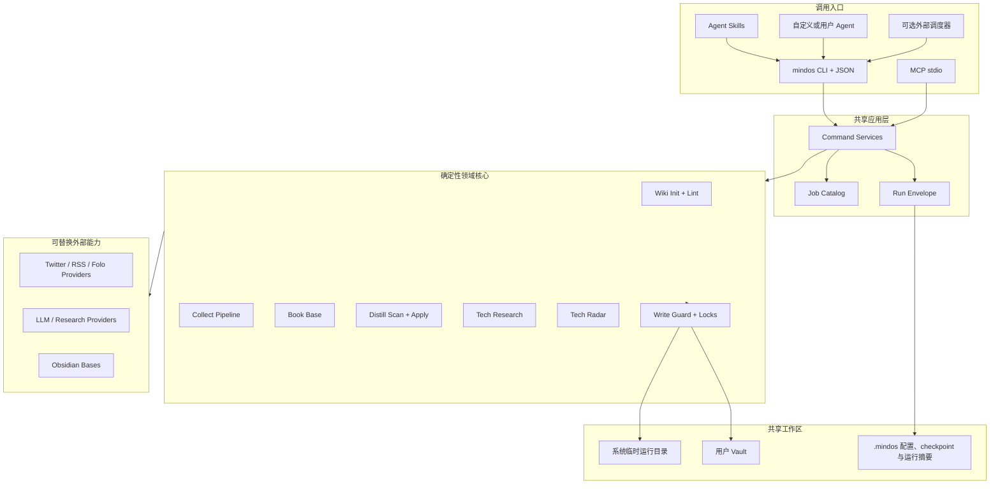
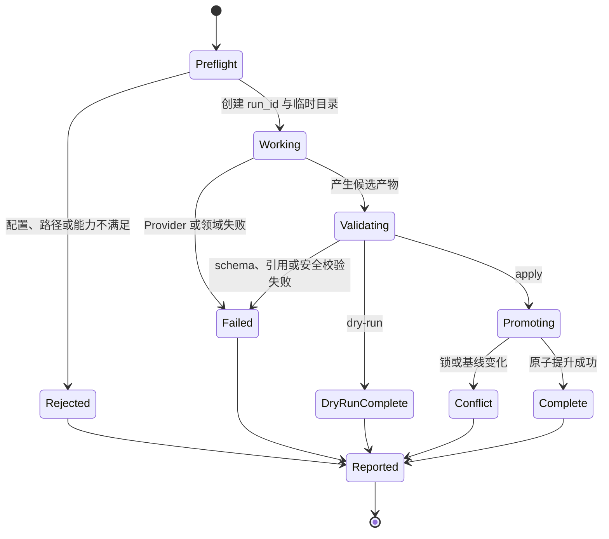
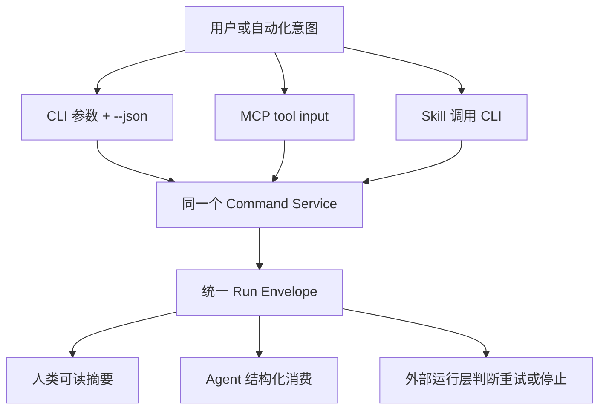

# Mind OS Builder - Plan

## Goal Capsule

- **目标：**在独立公开仓库中交付一套从空目录起步、可亲手跑通的个人 Mind OS 构建工具链；公开方法、契约和合成示例，不公开私人知识实例。
- **交付形态：**渐进式教程、可运行参考实现、可安装 CLI，以及建立在同一核心之上的 MCP、Agent Skills、自定义 Agent 与 Job 契约。
- **权威顺序：**用户确认的公开边界与运行层可替换要求优先于本计划；Product Contract 优先于 Planning Contract；Planning Contract 优先于单个实现单元的局部选择。
- **执行方式：**确定性核心采用测试先行；外部 Provider 先用夹具完成契约测试，再在 macOS 上执行受控的真实烟测。
- **停止条件：**实现需要复制私人 vault 内容、暴露凭证、绕过目标根目录写入保护，或外部服务条款与预期采集方式冲突时，停止并重新确认范围。
- **收尾责任：**只有离线端到端、真实 Provider 烟测、Obsidian 可视验收、发布审计和安装文档全部完成，才允许准备首次公开发布。

---

## Product Contract

### Summary

Mind OS Builder 将“如何搭建个人 Mind OS”做成一个可执行课程：用户先得到最小 LLM Wiki，再按需启用采集、读书、Distill、技术调研和任务契约。所有能力共享一个受保护的 Python 领域核心；CLI 是稳定自动化入口，MCP、Skills 和不同 Agent 工具只是适配器，具体调度运行层不属于核心产品。

### Problem Frame

现有 Mind-OS 已证明 LLM Wiki、Twitter/RSS 采集、Book Base、Distill 多角色和技术调研能够形成闭环，但它们分布在私人 vault、独立编排仓库、脚本、提示词和特定 Agent 配置中。直接公开当前仓库会泄露私人知识与路径；直接复制脚本又会把业务规则锁死在 OpenCLI、Folo、特定模型、特定 Agent 或调度器上。

公开版需要提取的是行为契约：什么是合法 vault、一次任务如何声明输入输出、外部 Provider 如何失败、何时允许写入、怎样保证重复运行不制造重复内容，以及不同 Agent 工具如何调用同一能力。第一版不追求平台或 Provider 数量，而追求从空目录到完整闭环的可复现证据。

### Actors

- A1. **初次搭建者：**会使用电脑和终端，但没有现成知识库工程经验，希望按教程从零建立本地 vault。
- A2. **已有 Agent 工具的知识工作者：**使用 Codex、Claude Code 或其他 Agent，希望通过 CLI、MCP 或 Skills 接入同一套任务。
- A3. **贡献者与 Provider 作者：**希望新增数据源、过滤规则或适配器，但不应修改核心写入、安全和结果契约。

### Requirements

**公开边界与首次体验**

- R1. 项目必须位于独立公开仓库，发布物只包含代码、契约、模板、教程和合成夹具，不包含私人 vault 的页面、历史、路径、凭证或过滤名单。
- R2. 用户必须先通过 `doctor` 区分必需、可选与实验能力，再在空目录执行初始化，得到 LLM Wiki 所需的 `raw/`、`wiki/`、`journals/`、模板、`schema.md`、vault 版 `AGENTS.md`、索引和日志。
- R3. 初始化后允许按模块启用采集、Book Base、Distill、Tech Research、Tech Radar、MCP 和 Jobs；第一版不建设第三方插件市场。
- R4. 第一版必须在 macOS 上完成真实端到端验证；Python 核心、文件契约和 CLI 不得依赖 macOS 专属 API。

**核心执行与安全**

- R5. 所有可自动调用的命令必须提供带 `api_version` 的稳定 JSON 结果，至少包含 `run_id`、`task`、`status`、`changed`、`artifacts`、`warnings`、`errors` 和 `metrics`；状态机必须区分 queued、running、waiting_approval、succeeded、partial、blocked、failed、timed_out、cancelled，并有稳定退出码映射。
- R6. 运行时中间产物必须默认写入权限受限的系统临时目录；可恢复 checkpoint 和精简运行摘要进入 `.mindos/runs/`，只有通过校验的最终业务产物进入 vault 正文目录，调试时才允许显式保留临时工作目录。
- R7. 所有写入必须经过目标根目录白名单、路径解析、防符号链接逃逸、原子替换或受控追加、文件锁和幂等检查；Agent 提示词不能成为安全边界。
- R8. `dry-run` 必须零文件写入、零外部状态变更；任何 `apply`、标记已读或内容追加都必须由调用方显式请求。
- R9. 业务参数进入 YAML 配置，凭证只从环境变量或操作系统凭证机制读取；日志、JSON 结果和错误包络不得回显密钥。每个动作必须声明 read、workspace_write、network、paid_call、external_state 五类 effect，后三类不能由未授权适配器静默触发。

**知识能力**

- R10. LLM Wiki 模块必须提供初始化和 lint 的确定性实现，并提供 Ingest、Query 回流和 Lint 的 Agent Skill 契约；lint 至少检查 frontmatter、索引、wikilinks、孤页、红链、超长页和受保护目录。
- R11. 采集模块必须按 Fetch、Normalize、Filter、可选 LLM Review、Render、Validate、Promote 分层，并至少跑通 Twitter 与 RSS 两条真实链路。
- R12. Twitter 必须有夹具 Provider 和一个 macOS 实测 Provider；RSS 必须以通用 RSS/Atom Provider 为确定性基线，Folo CLI 只能作为实验 Provider。
- R13. 过滤规则必须从 Provider 和 LLM 提示中分离，支持用户配置的包含、排除、评分与输出限制，并在结果中报告每条过滤原因和各阶段计数。
- R14. Book Base 模块必须生成 RIA 书籍模板、规范化 frontmatter 和显式限定 `wiki/books` 的 Obsidian `.base` 文件，并能校验已有书页是否符合属性约定。
- R15. Distill 必须由一个编排 Agent 管理 Lumina、Prism、Vector、Nexus、Ember 五个角色；标签扫描、段落定位、幂等、追加、锁和写入边界由确定性核心负责，模型只负责角色判断和回复正文。
- R16. Tech Research 必须支持可替换研究 Provider、分模式运行、证据和引用保存、部分 Provider 失败继续、阶段性进度、取消、checkpoint/resume 与最终研报输出，不得把多模型草稿直接当成事实或在恢复时重复已完成的付费调用。
- R17. Tech Radar 必须以结构化日期字段和分级规则生成 dry-run 报告，只有显式 apply 才能打标；物理搬运和高判断性的升级、归档默认由人确认。

**适配器与任务契约**

- R18. Agent Skills 必须遵守开放 Agent Skills 的目录与 `SKILL.md` 元数据规范，并只依赖稳定 CLI/JSON 契约；客户端专属工具名、权限语法和调度语法放在独立示例中。
- R19. MCP Server 必须是共享应用服务的薄适配器，首版使用本地 stdio、锁定稳定 MCP Python SDK v1，并把 vault 根目录和写入模式作为显式启动参数。
- R20. 项目必须提供 lint、distill、tech-radar、collect-twitter、collect-rss 和 tech-research 的声明式 Job；Task 表示一次版本化 Action 调用，Job 表示可复用的 Task 绑定、参数和 schedule hint，二者都不实现必选调度器。
- R21. 版本化 Capability Manifest 与 Action Registry 必须成为动作、输入 schema、effect、上下文和适配器覆盖面的唯一真相源；用户 Agent 可通过 CLI 帮助、JSON Schema、Job 清单、MCP tools/resources 或 Skills 发现相同能力与上下文，不能依赖隐藏对话历史。

**验证与发布**

- R22. CI 必须完全依赖合成夹具和本地模拟；真实 Provider 测试单独标记，只在用户显式提供凭证和开关时运行。
- R23. 项目必须生成一份 macOS MVP 烟测报告，记录从空目录到 Wiki、采集、Book Base、Distill、Tech Research、Tech Radar、Jobs 和 MCP 的真实结果与已知限制。
- R24. 首次公开发布前必须执行发布审计，检测私人绝对路径、凭证形态、真实 vault 内容、未允许资源和 wheel/package 中的意外文件。

### Key Flows

- F1. **从空目录建立最小 Wiki**
  - **触发：**A1 在新目录运行初始化。
  - **步骤：**预检目录与配置，生成临时变更集，校验模板和路径，原子提升到目标目录，再运行 lint。
  - **结果：**用户得到可读、可导航、无 lint 阻塞项的最小 LLM Wiki。
  - **覆盖：**R1-R10。
- F2. **采集并提升一份信号简报**
  - **触发：**A1 或 A2 运行 Twitter/RSS 采集命令或对应 Job。
  - **步骤：**Provider 抓取并返回游标，管线规范化、确定性过滤、可选 LLM Review、渲染和校验；dry-run 仅给报告，apply 才提升到 `raw/`。
  - **结果：**成功产物可追溯到来源；Provider 失败、限流或空结果都有结构化状态，不产生半成品。
  - **覆盖：**R5-R13、R20-R22。
- F3. **建立并使用 Book Base**
  - **触发：**A1 启用 books 模块并新建一本书。
  - **步骤：**安装 RIA 模板和 `.base`，生成或校验书页属性，在 Obsidian 中打开视图。
  - **结果：**书籍卡片/表格只查询 `wiki/books`，用户能编辑状态并回写 frontmatter。
  - **覆盖：**R14、R23。
- F4. **处理 Distill 活线程**
  - **触发：**A1 在日记段落添加 persona 标签，A2 运行 Distill Skill 或 Job。
  - **步骤：**核心扫描并输出待处理段落；编排 Agent 调用相应角色；核心重新读取目标文件、验证回复、加锁并追加 Callout。
  - **结果：**重复运行不重复追加；越权写入、基线变化和 Ember 共享状态冲突会显式失败或串行处理。
  - **覆盖：**R5-R9、R15、R18-R21。
- F5. **执行技术调研并形成可审计研报**
  - **触发：**A1 或 A2 通过 CLI、Skill、MCP 或 Job 提交主题、模式与重点。
  - **步骤：**选择可用 Provider，记录阶段性状态与证据，容忍单个 Provider 失败，综合并校验输出，最后提升研报。
  - **结果：**研报包含来源与失败缺口；中断后有运行摘要可供重试，不留下伪完成文件。
  - **覆盖：**R5-R9、R16、R18-R23。
- F6. **由任意 Agent 工具运行 Job**
  - **触发：**A2 的 Agent 或外部调度器读取 Job 清单并调用任务。
  - **步骤：**读取声明式契约，检查副作用模式和并发键，通过共享应用服务执行，消费统一结果包络。
  - **结果：**直接 CLI、MCP 或 Skill 对同一夹具产生等价领域结果；运行层只负责何时触发。
  - **覆盖：**R18-R21。

### Acceptance Examples

- AE1. **空目录初始化：**给定一个空临时目录，执行 core 初始化并 apply 后，所有核心文件存在、模板可解析、首次 lint 无阻塞项；再次执行返回 `changed: false`。
- AE2. **目录冲突：**给定包含未知文件或同名用户文件的目录，初始化默认停止并输出冲突清单，不覆盖任何字节；已有 vault 迁移留给后续专门流程。
- AE3. **真实 dry-run：**给定可写 vault、有效 Provider 和待处理内容，任何 dry-run 前后目录哈希、文件时间与外部已读状态均不变化，只产生 stdout/stderr 和系统临时数据。
- AE4. **Provider 部分失败：**给定 Twitter Provider 返回 429 或欠费错误、RSS 中一个 feed 超时，任务返回可识别错误与成功/失败计数，不提升半成品，并保留可安全重试的游标策略。
- AE5. **Distill 幂等与并发：**给定同一文件有多个角色标签和两个 Ember 段落，非共享角色可并行、Ember 依次提交；重复执行不追加重复 Callout，并发写入触发锁或基线冲突而不是丢失更新。
- AE6. **跨适配器一致性：**给定相同离线夹具和配置，CLI、MCP 内存测试与 Skill 调用得到相同 `status`、`changed`、artifacts 和 metrics；允许展示文本不同，不允许领域结果不同。
- AE7. **Book Base 可用：**给定两本合成书页，`.base` 能在真实 Obsidian 中显示 reading/done 视图，修改状态后 YAML 被正确回写，vault 其他目录的同名属性不进入视图。
- AE8. **发布隔离：**给定构建出的源码包和 wheel，发布审计找不到用户主目录、私人仓库路径、密钥、真实日记或未允许文件；安装后仍能从 package assets 初始化完整合成 vault。

### Success Criteria

- 一个没有现有 Mind-OS 的用户可以只依赖 README 和教程完成 core 初始化与离线演示。
- macOS 真实烟测至少完成一次 Twitter、一次通用 RSS/Atom、一次 Obsidian Book Base、一次 Distill、一次 Tech Research、一次 Tech Radar dry-run 和一次 MCP stdio 调用。
- 同一任务的 CLI、MCP 和 Skill 适配器通过契约一致性测试。
- 所有写任务均通过 dry-run、幂等、禁止路径、并发写和失败恢复测试。
- 源码包、wheel 与公开 Git 历史在首次推送前通过私人数据审计。

### Scope Boundaries

#### In Scope

- macOS 上亲测的本地 Python CLI、MCP stdio、Agent Skills 和 Codex 自定义 Agent 示例。
- 通用 RSS/Atom、Twitter 夹具与一个真实 Twitter Provider、实验 Folo Provider。
- LLM Wiki core、Book Base、Distill 五角色、Tech Research、Tech Radar 和声明式 Jobs。
- 合成示例 vault、教程、契约测试、离线端到端测试和手工烟测报告。

#### Deferred to Follow-Up Work

- Windows/Linux 的安装认证和真实 Provider 烟测。
- 已有 Obsidian vault 的自动迁移、合并与回滚工具。
- Dagster、Kestra、cron、launchd、GitHub Actions 或 Agent Automation 的正式调度适配包；第一版只给非规范性示例。
- 第三方 Provider 插件发现、动态安装和兼容性市场。
- MCP Streamable HTTP、远程认证、多租户和托管服务。
- qmd、向量检索、RAG 和大规模索引优化；页面增长到真实瓶颈后再引入。
- Ember/Nexus 自动结晶 M2/M3、无人值守 wiki 修改和全自动 Tech Radar 物理搬运。

#### Outside This Product's Identity

- 公开或同步用户的私人 vault、日记、`wiki/insights/` 或真实原始素材。
- 托管用户知识、账号系统、云端知识库或 SaaS 管理后台。
- 取代 `mind-os-public` 的文章发布站点与讨论系统。
- 将某个 Agent 客户端、模型厂商、采集服务或调度器设为系统唯一运行时。

### Dependencies

- Python 3.11+ 与支持 PEP 621 的打包工具；推荐用 `uv` 完成开发和独立安装烟测。
- Obsidian 桌面端及 Bases 核心插件用于最终可视验收。
- Twitter 真实烟测所选 Provider 的合法认证方式与预算；通用 RSS/Atom 不需要账号。
- 可选研究 Provider 的 API key；没有 key 时离线夹具和本地资料路径仍须可运行。

---

## Planning Contract

### Key Technical Decisions

- KTD1. **独立公开仓库，不从私人 vault 裁剪。**使用合成夹具重建行为，发布链路不得反向读取私人仓库。`(session-settled: user-directed — chosen over opening or sanitizing the private vault in place: only the build method and reusable contracts are public)`
- KTD2. **运行层可替换。**Jobs 只声明任务配置、执行契约和实现；Dagster、Kestra、cron、launchd 或用户 Agent 只负责触发。`(session-settled: user-directed — chosen over bundling one scheduler runtime: users may adapt the tasks to their own agent tools)`
- KTD3. **macOS 首发、核心跨平台。**真实烟测和安装文档先覆盖 macOS，核心不使用平台专属文件 API。`(session-settled: user-approved — chosen over certifying all desktop operating systems in the first release: one platform receives complete proof first)`
- KTD4. **一个 Distill 编排 Agent 加五个角色配置。**角色保持正交，但扫描、分发计划、追加与幂等由共享核心控制。`(session-settled: user-approved — chosen over five independent runtime services: one orchestrator preserves a smaller and safer execution surface)`
- KTD5. **Python 领域包是唯一业务实现。**`mindos` CLI、MCP Server 和 Skills 调用同一应用服务；CLI/JSON 是外部自动化的稳定参考契约，适配器不得复制领域规则。
- KTD6. **统一 Run Envelope、状态机与五阶段写入生命周期。**每次任务经历 preflight、work、validate、promote、report；状态覆盖 queued、running、waiting_approval、succeeded、partial、blocked、failed、timed_out、cancelled。中间数据进系统临时目录；只有 apply 或显式启用恢复的非 dry-run 运行才把 checkpoint 和精简摘要写入 `.mindos/runs/`，dry-run 只通过 stdout/stderr 与系统临时目录报告。
- KTD7. **Capability Manifest 与 Action Registry 是唯一真相源。**Action 定义输入、effect、上下文和结果；Task 是一次 Action 调用；Job 是可复用 Task 配置。core、collect、books、distill、research、radar、jobs、mcp 是内置模块，第三方动态插件发现延期。
- KTD8. **采集按领域阶段拆分。**Provider 只负责 fetch/cursor；公共管线负责 normalize/filter/review/render/validate/promote，避免当前脚本把来源、过滤、模型与 Markdown 合并逻辑揉在一起。
- KTD9. **通用 RSS/Atom 是稳定基线。**Folo CLI 锁定版本并标为实验；Twitter 提供离线夹具和一个真实 macOS Provider，X API 或 OpenCLI 的差异由 capability 声明隔离。
- KTD10. **写入守卫高于 Agent 权限。**任何 Agent 返回值都视为不可信输入；只有核心可以按版本化路径能力表追加或提升。`raw/logseq-import/` 与 `wiki/insights/` 永远不可写，`raw/research/` 只对 research capability 开放，其他 apply 均受目标白名单限制。
- KTD11. **Agent Skills 保持客户端中立。**公共 Skill 只包含规范 frontmatter、工作流和 CLI 调用；Codex/Claude 专属 agent 配置作为可选 adapter assets，不进入规范核心。
- KTD12. **MCP 首版锁定 v1 且仅提供本地 stdio。**依赖范围使用 `mcp>=1.27,<2`；stdout 仅用于协议，日志走 stderr，vault 根目录在启动时固定。MCP v2 和远程传输单独迁移。
- KTD13. **高判断动作默认停在人类确认前。**Tech Radar 物理搬运、自动结晶、已有 vault 合并和外部已读变更不进入默认自动路径；dry-run 报告本身不写 `wiki/log.md`。
- KTD14. **effect 决定审批，不由入口决定。**network、paid_call、external_state 需要显式授权或有范围和过期时间的预批准；OAuth、密码、系统权限弹窗和条款接受始终由人完成。

### High-Level Technical Design

#### Component Topology



#### Run Lifecycle



#### Cross-Adapter Parity



### Output Structure

```text
.
├── AGENTS.md
├── LICENSE
├── README.md
├── pyproject.toml
├── docs/
│   ├── architecture.md
│   ├── security-and-privacy.md
│   ├── agent-adapters.md
│   ├── jobs.md
│   ├── providers.md
│   ├── getting-started/
│   ├── modules/
│   ├── plans/
│   └── verification/mvp-smoke.md
├── src/mind_os_builder/
│   ├── cli/
│   ├── application/
│   ├── core/
│   ├── wiki/
│   ├── collect/
│   │   ├── providers/
│   │   ├── filters/
│   │   └── renderers/
│   ├── books/
│   ├── distill/
│   ├── research/
│   ├── radar/
│   ├── jobs/
│   ├── mcp/
│   └── assets/
│       ├── vault/
│       ├── jobs/
│       ├── agents/
│       └── skills/
├── examples/
│   ├── config/
│   └── synthetic-vault/
├── tests/
│   ├── unit/
│   ├── integration/
│   ├── contract/
│   ├── e2e/
│   ├── live/
│   └── fixtures/
└── scripts/
    └── audit_release.py
```

### Sequencing

U1 和 U2 建立发布边界、包结构、运行包络与安全写入；U3-U6 在同一核心上实现四类能力，可在 U2 完成后并行推进。U7 用实际任务检验 Job 契约，U8 再暴露 Skills 与 MCP，避免适配器先于领域行为定型。U9 最后以新机器视角完成教程、安装、真实烟测和发布审计。

### System-Wide Impact

- **数据生命周期：**每个运行都有临时工作区；apply 或显式启用恢复的非 dry-run 运行才保存精简持久摘要，dry-run 不写 `.mindos/runs/`。失败产物默认清理，明确保留时才暴露路径。
- **权限边界：**CLI 与 MCP 都必须绑定允许 vault 根目录；角色 Agent 不直接获得任意文件写权限。
- **兼容性：**CLI/JSON、Job Schema、Provider Protocol、Skill metadata 和 MCP tool schema 都是外部契约，修改必须有契约测试和迁移说明。
- **成本与外部状态：**X API、研究 Provider 与 Folo 可能计费或改变远端状态；预算、超时、重试、dry-run 和 capability 必须进入结果模型。
- **用户理解成本：**README 只引导 core 闭环；高级模块在用户看见价值后逐层启用，避免一次安装所有凭证和工具。

### Risks and Mitigations

| 风险 | 影响 | 计划内缓解 |
|---|---|---|
| 复制私人实现时带出路径、内容或凭证 | 公开泄露不可逆 | 合成重写、资源允许清单、源码包与 wheel 双重发布审计 |
| X API 计费、搜索窗口或认证变化 | 真实 Twitter 链路失效或超预算 | Provider capability、预算错误、夹具契约、OpenCLI/X API 可替换 |
| Folo CLI 仍在早期阶段 | JSON 或认证契约漂移 | 锁版本、标记实验、通用 RSS/Atom 作为基线、契约烟测 |
| MCP Python SDK v2 破坏性升级 | MCP 适配器失效 | 锁定 v1、适配层隔离、v2 作为独立迁移关卡 |
| Obsidian Bases 仅做 YAML 校验仍可能不可用 | 读书模块假通过 | 真实 Obsidian 打开、视图过滤与属性回写手工验收 |
| Agent 忽略提示词或越权写入 | 重复内容、丢失更新、私人目录被改 | 核心写入守卫、锁、read-after-write、基线哈希和显式告警 |
| Tech Research 长时间无输出或部分 Provider 失败 | 调度器误判卡死或产生伪研报 | 阶段事件、超时、部分失败包络、临时产物、可重试运行摘要 |
| 初学者一次面对太多模块 | 安装放弃、凭证配置错误 | core-first 教程、模块化 enable、离线 demo、每章独立验收 |
| 直接移植现有超大采集文件 | Provider、规则和渲染继续耦合 | 按阶段和 Protocol 重写，只搬可验证行为与测试案例 |

### Sources and Research

**私有 Mind-OS 仓库中的行为来源**

- `raw/publish/2026-05-19-from-llm-wiki-to-personal-harness.md`：三层体系、starter 分级、采集、RIA、Distill 与“刻意停顿”的产品边界。
- `schema.md`、`AGENTS.md`：LLM Wiki 目录、frontmatter、wikilinks、索引、日志和只读边界。
- `.agents/skills/source-command-distill/SKILL.md`、`scripts/distill-scout.py`：标签分发、幂等、Ember 串行和 read-after-write 经验。
- `.agents/skills/source-command-radar-review/SKILL.md`、`wiki/concepts/tech-radar.md`：日期字段、dry-run/apply 和“机器建议、人类搬运”。
- `.agents/skills/tech-research/`：多 Provider 路由、错误隔离和研报模板。
- `templates/book-template.md`、`wiki/books/books.base`：RIA 与 Bases 的已运行配置。

**现有 `mind-os-orchestration` 仓库中的实现来源**

- `orchestration/local_flows.py`、`orchestration/runtime_context.py`：调度器外的一次性本地 flow 与运行上下文。
- `orchestration/assets/x_twitter.py`、`orchestration/assets/rss_folo.py`：真实采集阶段、合并、修复、提升和验证行为。
- `orchestration/llm/providers.py`：LLM Provider 顺序、瞬时错误重试和 fallback。
- `tests/test_x_twitter_quality.py`、`tests/test_rss_folo_flows.py`、`tests/test_llm_providers.py`：应迁移为公共行为契约的质量与失败场景。

**官方外部契约**

- [Agent Skills Specification](https://agentskills.io/specification)：Skill 目录、`SKILL.md` 和 frontmatter 的可移植最低要求。
- [Agent Skills Client Implementation](https://agentskills.io/client-implementation/adding-skills-support)：安装位置与客户端专属字段不属于规范核心。
- [MCP Python SDK](https://github.com/modelcontextprotocol/python-sdk)：共享 Python 服务、stdio 与内存测试；首版锁定稳定 v1。
- [MCP Security Best Practices](https://modelcontextprotocol.io/docs/tutorials/security/security_best_practices)：stdio 权限继承、最小权限和用户同意边界。
- [X API Pricing](https://docs.x.com/x-api/getting-started/pricing) 与 [Post Search](https://docs.x.com/x-api/posts/search/introduction)：预付费、搜索窗口、认证和预算失败约束。
- [Obsidian Bases Syntax](https://obsidian.md/help/bases/syntax) 与 [Properties](https://obsidian.md/help/properties)：`.base` 是 YAML 视图定义，数据来自 note/file/formula 属性。
- [Folo CLI](https://github.com/RSSNext/Folo/tree/dev/apps/cli)：可选 CLI Provider 的早期契约与版本漂移风险。

---

## Implementation Units

### U1. Public Repository Foundation

- **Goal：**建立独立、可打包、默认安全的公开仓库骨架，并把私人边界做成可验证发布规则。
- **Requirements：**R1、R4、R22、R24；实现 KTD1、KTD3。
- **Dependencies：**无。
- **Files：**`README.md`、`AGENTS.md`、`LICENSE`、`pyproject.toml`、`.gitignore`、`docs/architecture.md`、`docs/security-and-privacy.md`、`src/mind_os_builder/__init__.py`、`scripts/audit_release.py`、`tests/unit/test_release_audit.py`、`tests/integration/test_package_assets.py`。
- **Approach：**使用 `src/` 布局和 PEP 621 元数据；明确 builder 与 `mind-os-public`、私人 vault、现有编排仓库的单向参考关系。发布审计采用资源允许清单，扫描源码、构建产物，以及准备推送的所有 Git 引用可达的 commit、tree 和 blob 中的绝对用户路径、常见密钥形态、禁止目录名和非合成 Markdown。
- **Execution note：**先建立失败的发布审计测试，再加入任何从现有仓库重写的 assets。
- **Patterns to follow：**沿用 `mind-os-public` 的“私有母本不成为公开构建依赖”边界；不复制其中的文章发布产品结构。
- **Test scenarios：**
  - 合成仓库通过审计，加入 `/Users/<name>/private/...`、API key、真实 journal 路径或未允许 Markdown 后审计失败并列出文件。
  - 先提交密钥或私人路径、再在后续提交删除时，准备推送的历史审计仍失败并定位对应 Git 对象。
  - 构建 wheel 后只包含声明的 Python 模块、vault assets、jobs、agents 和 skills；临时文件、测试夹具和 `.env` 不进入 wheel。
  - 在隔离虚拟环境安装 wheel 后，可以导入包并显示 CLI 帮助。
- **Verification：**公开边界、包元数据和审计均可由 CI 重现，目标目录不依赖私人仓库存在。

### U2. Core Runtime, Wiki Init, and Lint

- **Goal：**实现统一运行生命周期、安全文件操作、模块注册、CLI 框架、最小 vault 初始化和 lint。
- **Requirements：**R2-R10、R21；实现 KTD5-KTD7、KTD10。
- **Dependencies：**U1。
- **Files：**`src/mind_os_builder/cli/main.py`、`src/mind_os_builder/application/commands.py`、`src/mind_os_builder/core/config.py`、`src/mind_os_builder/core/context.py`、`src/mind_os_builder/core/capabilities.py`、`src/mind_os_builder/core/results.py`、`src/mind_os_builder/core/run_store.py`、`src/mind_os_builder/core/workspace.py`、`src/mind_os_builder/core/write_guard.py`、`src/mind_os_builder/core/locks.py`、`src/mind_os_builder/core/modules.py`、`src/mind_os_builder/core/doctor.py`、`src/mind_os_builder/wiki/init.py`、`src/mind_os_builder/wiki/lint.py`、`src/mind_os_builder/assets/capabilities.yaml`、`src/mind_os_builder/assets/vault/core/AGENTS.md`、`src/mind_os_builder/assets/vault/core/schema.md`、`src/mind_os_builder/assets/vault/core/wiki/index.md`、`src/mind_os_builder/assets/vault/core/wiki/log.md`、`tests/unit/test_results.py`、`tests/unit/test_run_store.py`、`tests/unit/test_write_guard.py`、`tests/unit/test_locks.py`、`tests/contract/test_capability_manifest.py`、`tests/integration/test_doctor.py`、`tests/integration/test_init.py`、`tests/integration/test_lint.py`。
- **Approach：**Capability Manifest 生成 CLI/MCP/Skill 一致性校验所需元数据；应用服务返回统一 Run Envelope，CLI 同时提供人类输出与 `--json`。doctor 区分必需、可选和实验能力。初始化先在系统临时目录生成 manifest 和内容哈希，校验后再提升；非空目录或同名冲突默认停止。lint 只读扫描普通 Wiki 页面，按 schema 配置跳过系统文件与受保护目录，并把问题分类为 error/warning/info。
- **Execution note：**对写入守卫、符号链接逃逸、幂等初始化和冲突保护采用测试先行；初始化完成后立刻跑 lint 作为集成证明。
- **Patterns to follow：**复用私人 `schema.md` 的 raw/wiki 权属、frontmatter、wikilink、index、log 和 500 行规则；修正现有 scout“所有情况退出 0”不适合 Job 的失败语义。
- **Test scenarios：**
  - 空目录 apply 成功并通过 lint；重复 apply 不改变文件哈希。
  - 非空目录、同名文件内容不同、目标是 symlink、路径包含 `..` 时拒绝写入。
  - dry-run 前后目标目录和 `.mindos/` 均无变化。
  - 两个进程同时初始化同一目标时只有一个提升成功，另一个返回 conflict。
  - lint 识别缺 frontmatter、索引缺失、断链、红链、孤页、超长页，并不读取或修改 `wiki/insights/` 内容。
  - 进程重启后 run store 保留终态和 checkpoint；cancel、timeout 和 waiting_approval 有稳定状态与退出码。
- **Verification：**离线集成测试从空目录得到完整 core vault；所有失败都有稳定状态、退出码与不含密钥的 JSON。

### U3. Collection Pipeline and Providers

- **Goal：**实现可替换的数据源、独立过滤规则和可审计提升链路，跑通 Twitter 与 RSS。
- **Requirements：**R5-R13、R22-R23；实现 KTD8-KTD10。
- **Dependencies：**U2。
- **Files：**`src/mind_os_builder/collect/models.py`、`src/mind_os_builder/collect/contracts.py`、`src/mind_os_builder/collect/pipeline.py`、`src/mind_os_builder/collect/cursors.py`、`src/mind_os_builder/collect/providers/rss_feed.py`、`src/mind_os_builder/collect/providers/twitter_fixture.py`、`src/mind_os_builder/collect/providers/twitter_opencli.py`、`src/mind_os_builder/collect/providers/folo_cli.py`、`src/mind_os_builder/collect/filters/rules.py`、`src/mind_os_builder/collect/filters/llm_review.py`、`src/mind_os_builder/collect/renderers/brief.py`、`src/mind_os_builder/assets/vault/collect/config.yaml`、`tests/unit/test_collect_rules.py`、`tests/unit/test_collect_cursors.py`、`tests/integration/test_collect_rss.py`、`tests/integration/test_collect_twitter.py`、`tests/contract/test_provider_contract.py`、`tests/live/test_live_twitter.py`、`tests/live/test_live_rss.py`。
- **Approach：**定义规范 Signal 与 Provider capability；Provider 不写 vault。管线在临时目录保留每阶段 JSON，确定性规则先降噪，可选 LLM Review 只返回结构化决策；验证引用、语言、重复 ID 和 frontmatter 后才提升。游标只在最终提升成功后提交，partial failure 不前移。
- **Execution note：**先从现有 Twitter/RSS 测试抽取行为夹具，不复制个人作者名单、关键词和输出；真实 Provider 在离线契约通过后再烟测。
- **Patterns to follow：**保留现有 `run_x_twitter_raw → candidates → llm_summary → brief_draft → raw_brief` 的阶段证据、Provider fallback 和每日简报去重；把 `x_twitter.py`、`rss_folo.py` 中混合的职责拆开。
- **Test scenarios：**
  - RSS/Atom 多 feed 正常、单 feed 超时、重复 guid、缺发布日期、HTML 正文和恶意提示文本均产生预期规范化与过滤结果。
  - Twitter fixture 验证具体工程信号保留、空泛趋势/收益故事过滤、现有简报合并去重和引用修复。
  - OpenCLI 不存在、输出非 JSON、认证失效、超时、429/预算错误时返回明确 Provider error，不提升产物。
  - LLM Provider 全不可用时按配置选择启发式降级或失败；降级必须出现在 warnings，不能伪装为完整 LLM 审阅。
  - apply 成功后游标前移；验证失败或 promote 冲突时游标不变。
- **Verification：**CI 完成 Twitter/RSS 离线管线；macOS 烟测真实生成两份带来源、计数和过滤报告的简报。

### U4. Book Base and RIA Module

- **Goal：**把 RIA 读书方法、书页属性和 Obsidian Bases 视图做成可初始化、可校验模块。
- **Requirements：**R3、R14、R22-R23。
- **Dependencies：**U2。
- **Files：**`src/mind_os_builder/books/init.py`、`src/mind_os_builder/books/validate.py`、`src/mind_os_builder/assets/vault/books/templates/book-template.md`、`src/mind_os_builder/assets/vault/books/wiki/books/books.base`、`src/mind_os_builder/assets/vault/books/wiki/books/example-book.md`、`docs/modules/books.md`、`tests/unit/test_book_schema.py`、`tests/integration/test_books_init.py`、`tests/live/test_obsidian_books.md`。
- **Approach：**书页 frontmatter 明确 domain、sources、created、updated 与 Bases 属性；`.base` 顶层过滤严格限制 `wiki/books`、Markdown 扩展名和运行时状态文件。CLI 提供模块初始化与只读校验，不在第一版自动导入全量微信读书数据。
- **Patterns to follow：**以私人仓库的 R/I/A 固定标题、原始触动点区、书籍反向连接和 `books.base` 四视图为行为来源；weread 仅是可选输入，不成为 Book Base 依赖。
- **Test scenarios：**
  - 启用模块生成模板、`.base` 和合成书页，重复启用不覆盖用户编辑。
  - 缺 status、日期非法、状态枚举错误、运行时文件进入视图时校验失败。
  - `.base` 可解析为 YAML，过滤条件不包含 vault 其他目录。
  - 真实 Obsidian 打开后 reading/done 视图显示正确，编辑 status 回写书页 frontmatter。
- **Verification：**离线 schema 与初始化测试通过，并在 macOS Obsidian 中记录可视检查结果。

### U5. Distill Orchestrator and Role Contracts

- **Goal：**实现一个安全编排器和五个正交角色，把标签扫描与文件副作用从提示词移入核心。
- **Requirements：**R5-R9、R15、R18、R21-R23；实现 KTD4、KTD10-KTD11、KTD13。
- **Dependencies：**U2、U4。
- **Files：**`src/mind_os_builder/distill/models.py`、`src/mind_os_builder/distill/scanner.py`、`src/mind_os_builder/distill/dispatch.py`、`src/mind_os_builder/distill/apply.py`、`src/mind_os_builder/distill/idempotency.py`、`src/mind_os_builder/assets/agents/orchestrator.md`、`src/mind_os_builder/assets/agents/roles/lumina.md`、`src/mind_os_builder/assets/agents/roles/prism.md`、`src/mind_os_builder/assets/agents/roles/vector.md`、`src/mind_os_builder/assets/agents/roles/nexus.md`、`src/mind_os_builder/assets/agents/roles/ember.md`、`src/mind_os_builder/assets/agents/codex/lumina.toml`、`src/mind_os_builder/assets/agents/codex/prism.toml`、`src/mind_os_builder/assets/agents/codex/vector.toml`、`src/mind_os_builder/assets/agents/codex/nexus.toml`、`src/mind_os_builder/assets/agents/codex/ember.toml`、`tests/unit/test_distill_scanner.py`、`tests/unit/test_distill_apply.py`、`tests/integration/test_distill_flow.py`、`tests/contract/test_role_contracts.py`。
- **Approach：**`scan` 以规范化内容、文件身份和 persona 生成稳定 trigger_id，并输出上下文、目标路径与基线哈希；编排 Agent 只返回符合角色 schema 的 Callout；`apply` 重新读取文件，验证段落仍存在、检测 sidecar/内嵌处理标记、按段落倒序追加。Ember 使用共享 concurrency key 串行处理，其他角色可以并行。编排器与角色定义以中立 Markdown 为规范，Codex TOML 是适配资产。
- **Execution note：**先复现 Nexus 越权写入导致基线变化、重复调用和多 Ember 写竞态，再实现锁与 read-after-write 保护。
- **Patterns to follow：**保留 `source-command-distill` 的标签优先级、嵌套列表缩进、倒序追加、Callout 格式和 persona 边界；核心不再依赖子 Agent 自律保证幂等。
- **Test scenarios：**
  - 普通段落、列表嵌套、多标签、`#book/*`、已处理段落和相邻标签得到正确 dispatch plan。
  - 相同 plan apply 两次只有一次写入；段落在模型执行期间被编辑时返回 conflict。
  - Nexus 提前写入日记时核心检测到已有 Callout，幂等跳过并产生告警。
  - 两个 Ember 段落共享锁且顺序提交；Lumina/Prism 与 Ember 无共享状态时可并行。
  - 角色输出试图写出 journals、raw 或 insights 路径、包含非法 Callout 结构时被拒绝。
- **Verification：**合成日记完成 scan → 模拟角色回复 → apply 的完整闭环，重复和并发测试无丢失更新。

### U6. Tech Research Providers and Reports

- **Goal：**把现有多 Provider 调研脚本重构为可观察、可降级、可审计的研究能力。
- **Requirements：**R5-R9、R16、R20-R23。
- **Dependencies：**U2。
- **Files：**`src/mind_os_builder/research/models.py`、`src/mind_os_builder/research/contracts.py`、`src/mind_os_builder/research/router.py`、`src/mind_os_builder/research/runner.py`、`src/mind_os_builder/research/report.py`、`src/mind_os_builder/research/providers/`、`src/mind_os_builder/assets/vault/research/report-template.md`、`tests/unit/test_research_router.py`、`tests/unit/test_research_report.py`、`tests/integration/test_tech_research.py`、`tests/contract/test_research_provider_contract.py`、`tests/live/test_live_research.py`。
- **Approach：**ResearchProvider 明确搜索、深度研究、综合与 citations capability；router 根据 mode、可用凭证和显式顺序选择 Provider。每个阶段产生事件、checkpoint 与 ProviderResult；报告区分事实证据、模型草稿、失败缺口和最终判断。取消或中断保留可恢复 checkpoint，未验证草稿不能提升到 `raw/research` 正式路径。
- **Execution note：**优先复现“深度 Provider 长时间无阶段输出”的失败，先建立超时、进度和部分失败包络，再接真实 API。
- **Patterns to follow：**沿用现有 `selected_providers`、Provider error 隔离、quick/standard/deep 和报告模板；修正顺序执行时无进度、草稿与正式研报边界不清的问题。
- **Test scenarios：**
  - 无任何 key、部分 key、未知 Provider、Provider 超时、返回空 citations 和单个 Provider 崩溃均得到确定状态。
  - quick/standard/deep 选择预期 capability；显式 provider 顺序覆盖默认值。
  - 包含两个来源和一个失败 Provider 的结果生成带引用、缺口和 Provider 状态的研报。
  - 运行中断不生成正式研报；重试使用新 run_id，并能引用上一运行错误摘要。
  - 日志、临时文件和结果 JSON 不包含 API key。
- **Verification：**离线 fake Provider 证明完整流程；至少一个真实 Provider 在 macOS 上生成可核查研报并写入烟测报告。

### U7. Tech Radar and Declarative Jobs

- **Goal：**实现可被任意运行层触发的 Job 契约，并以 Radar、Lint、Distill 和采集任务验证它。
- **Requirements：**R5-R9、R17、R20-R23；实现 KTD2、KTD6、KTD13。
- **Dependencies：**U2、U3、U5、U6。
- **Files：**`src/mind_os_builder/jobs/models.py`、`src/mind_os_builder/jobs/catalog.py`、`src/mind_os_builder/jobs/runner.py`、`src/mind_os_builder/radar/parser.py`、`src/mind_os_builder/radar/review.py`、`src/mind_os_builder/assets/jobs/lint.yaml`、`src/mind_os_builder/assets/jobs/distill.yaml`、`src/mind_os_builder/assets/jobs/tech-radar.yaml`、`src/mind_os_builder/assets/jobs/collect-twitter.yaml`、`src/mind_os_builder/assets/jobs/collect-rss.yaml`、`src/mind_os_builder/assets/jobs/tech-research.yaml`、`docs/jobs.md`、`tests/unit/test_job_schema.py`、`tests/unit/test_radar_review.py`、`tests/integration/test_job_runner.py`、`tests/integration/test_radar_job.py`。
- **Approach：**版本化 Job YAML 声明 Action/Task 绑定、inputs、outputs、effects、default_mode、concurrency_key、timeout、retry、success 状态、required_capabilities/secrets、schedule_hint 和 timezone。runner 只执行 Registry 中的 command service，不解释 cron，并支持 status、cancel、resume。Radar parser 从配置定位当前页，按规范日期和来源计算建议；dry-run 不写任何文件，apply 只追加幂等标记和显式审计记录。
- **Patterns to follow：**保留现有 Radar 的 12/14 天阈值、升级候选、双归档和“机器建议、人类搬运”；修正旧 Skill 在 dry-run 仍更新 `wiki/log.md`、文件拆月后仍硬编码单页的问题。
- **Test scenarios：**
  - Job schema 缺 effects、concurrency_key 或成功状态时拒绝加载；未知 Job 返回配置错误。
  - lint、collect、distill、radar 和 research Job 的输入输出与直接 command service 一致。
  - Radar 在 11、12、14 天边界正确分组，跨年日期、多个来源、已编译/未编译产生正确建议。
  - dry-run 前后文件哈希不变；同日 apply 两次不重复标记或日志。
  - 同一 concurrency key 的两个 Job 不并发写，相互独立的 Job 可以并发。
- **Verification：**`job list/describe/run --json` 能被无状态外部进程消费，且所有 Job 在离线夹具上给出稳定结果。

### U8. Agent Skills and MCP Adapters

- **Goal：**让 Codex、Claude Code 与其他 Agent 工具通过标准化入口获得动作和上下文一致性。
- **Requirements：**R18-R22；实现 KTD5、KTD11-KTD12。
- **Dependencies：**U2-U7。
- **Files：**`src/mind_os_builder/assets/skills/mind-os/SKILL.md`、`src/mind_os_builder/assets/skills/wiki-ingest/SKILL.md`、`src/mind_os_builder/assets/skills/wiki-query/SKILL.md`、`src/mind_os_builder/assets/skills/distill/SKILL.md`、`src/mind_os_builder/assets/skills/tech-research/SKILL.md`、`src/mind_os_builder/assets/skills/radar-review/SKILL.md`、`src/mind_os_builder/mcp/server.py`、`src/mind_os_builder/mcp/tools.py`、`src/mind_os_builder/mcp/resources.py`、`docs/agent-adapters.md`、`docs/action-parity.md`、`tests/contract/test_skill_spec.py`、`tests/contract/test_cli_json_contract.py`、`tests/contract/test_mcp_tools.py`、`tests/integration/test_adapter_parity.py`。
- **Approach：**Skill 的 name/description/relative resources 遵守开放规范，并用 compatibility 声明 Python CLI 前置条件。MCP tools 暴露 init/lint/collect/distill scan/apply/research/radar/job primitives，写操作默认 dry-run；resources 暴露 capability、job、config schema 和 run summary。stdio server 启动时固定 vault root，日志只写 stderr。
- **Execution note：**以同一夹具的跨适配器契约测试为先，不用端到端 prompt 测试替代领域结果比较。
- **Patterns to follow：**沿用现有项目 Skills 的渐进资源目录和 role assets；移除 `$ARGUMENTS`、Claude Task、Codex subagent 等客户端专属假设，放入单独客户端示例。
- **Test scenarios：**
  - 每个 Skill 的目录名、frontmatter name、description、相对引用和 compatibility 合法；未允许的客户端专属字段触发检查。
  - CLI JSON schema 在成功、noop、partial、conflict 和 config_error 情况保持一致。
  - MCP 内存测试和 CLI 对同一任务返回等价领域结果；stdio stdout 无日志污染。
  - MCP 未声明 vault root、请求越界路径或远程写模式时拒绝启动/执行。
  - 自定义 Agent 只拥有角色输出能力时仍能通过核心 apply 完成 Distill，不需要任意文件写权限。
- **Verification：**官方 MCP inspector 或 SDK 内存客户端完成 tools/resources 调用；至少在 Codex 中安装并运行一个公共 Skill 和五个角色示例。

### U9. Progressive Tutorial, End-to-End Proof, and Release Gate

- **Goal：**以新用户视角完成从零到完整体系的教程、离线演示、真实烟测和首次发布门禁。
- **Requirements：**R1-R4、R22-R24。
- **Dependencies：**U1-U8。
- **Files：**`docs/getting-started/00-overview.md`、`docs/getting-started/01-core-wiki.md`、`docs/getting-started/02-collection.md`、`docs/getting-started/03-books.md`、`docs/getting-started/04-distill.md`、`docs/getting-started/05-research-and-radar.md`、`docs/getting-started/06-agent-adapters.md`、`docs/providers.md`、`docs/verification/mvp-smoke.md`、`examples/config/`、`examples/synthetic-vault/`、`tests/e2e/test_full_journey.py`、`tests/live/test_live_mvp.py`、`.github/workflows/ci.yml`。
- **Approach：**教程按 core-first 模块递进，每章给出前置条件、动作、可见产物、失败排查和完成检查。离线 E2E 使用 wheel 安装与合成 Provider；真实 smoke 在新的临时 vault 中运行，凭证由环境注入，结果脱敏后写入固定报告。CI 不访问私人路径或真实 Provider。
- **Execution note：**先在干净临时环境按文档执行，不让实现者的源码工作区或已有 vault 掩盖安装缺陷。
- **Patterns to follow：**沿用原文章 L0-L3 的渐进难度，但将每级改成可执行、可验证模块；Book Base 保留真实 Obsidian 验收，外部任务运行层只作示例。
- **Test scenarios：**
  - 从 wheel 安装后，离线用户按教程完成 init、lint、RSS/Twitter fixture、books、Distill fake agent、research fake provider、radar 和 job。
  - 删除可选凭证后 core 和离线 demo 仍可用，相关高级命令给出明确 capability 缺失提示。
  - 真实 macOS smoke 使用独立临时 vault，不读取私人 vault；同一合成日记触发编排器和五个角色，产生的报告经过脱敏和发布审计。
  - CI 在无网络、无 Obsidian、无 API key 环境完成所有非 live 测试。
  - 构建源码包和 wheel 后再次运行发布审计，确认没有实验死代码、临时数据或私人内容。
- **Verification：**一名不参与实现的人或干净 Agent 会话仅凭 README/教程完成离线闭环；维护者完成并签署 `docs/verification/mvp-smoke.md`。

---

## Verification Contract

| Gate | Applies To | Command or Check | Done Signal |
|---|---|---|---|
| 静态质量 | U1-U9 | `uv run ruff check .`、`uv run mypy src` | 无 lint/type 错误 |
| 单元测试 | U1-U8 | `uv run pytest tests/unit` | 核心规则、边界和失败语义全部通过 |
| 集成测试 | U2-U8 | `uv run pytest tests/integration` | 文件系统、管线、Job 和适配器闭环通过 |
| 契约测试 | U2、U3、U5、U6、U8 | `uv run pytest tests/contract` | Provider、Run Envelope、Skill、Role、MCP schema 稳定 |
| 离线端到端 | U9 | `uv run pytest tests/e2e/test_full_journey.py` | 从 wheel 安装到完整合成 vault 闭环通过 |
| 打包验证 | U1、U9 | `uv build` 后在隔离环境安装产物 | CLI、assets、skills、agents 和 jobs 均可发现 |
| 发布审计 | U1、U9 | `uv run python scripts/audit_release.py` | 源码、Git 跟踪文件和构建产物无私人数据 |
| 真实 Provider | U3、U6、U9 | 显式启用 `tests/live` | Twitter、RSS、研究 Provider 的真实证据写入脱敏报告 |
| Obsidian 可视检查 | U4、U9 | 在真实 Obsidian 打开合成 vault | Bases 视图、过滤与属性回写符合 AE7 |
| MCP/Agent 适配 | U8、U9 | SDK 内存客户端、stdio smoke、Codex Skill smoke | CLI/MCP/Skill 领域结果符合 AE6 |

真实 Provider 和 Obsidian Gate 不进入无凭证 CI，但在首次公开发布前为强制人工 Gate。任何真实测试不得把返回原文、用户名、token 或私人路径提交到仓库。

---

## Definition of Done

- R1-R24 均由至少一个 U-ID 和一个可执行验证场景覆盖，无 launch-blocking 问题。
- U1-U9 的文件、测试、文档与依赖顺序全部实现，所有非 live Gate 在干净 CI 环境通过。
- AE1-AE8 均有自动测试或明确的 macOS/Obsidian 人工验收记录。
- `mindos` CLI 的 JSON 契约、Job Schema、Provider Protocol、Skill metadata 和 MCP schema 已有版本化契约测试。
- Capability Manifest、Action Registry 与 `docs/action-parity.md` 证明 init、lint、collect、books、distill、research、radar 和 jobs 在各适配入口的动作与上下文覆盖一致。
- macOS 上完成真实 Twitter、RSS、Book Base、Distill、Tech Research、Tech Radar、Jobs 和 MCP 烟测，`docs/verification/mvp-smoke.md` 记录结果与限制。
- dry-run、路径越界、符号链接、重复执行、并发写、Provider 超时、部分失败和中断恢复均有通过证据。
- 源码包、wheel 和准备推送的 Git 文件通过发布审计；不存在私人 vault 内容、密钥、绝对用户路径或真实日志。
- 文档明确区分核心能力、实验 Provider、可选 Agent 适配器和外部调度运行层。
- 实现期间产生但未采用的实验代码、临时适配器、重复脚本和死配置已删除，不留在最终 diff 中。
- 首次公开发布前由仓库所有者确认开源许可证、仓库名称和真实 Provider 的使用条款；这些确认不改变已实现的领域架构。
