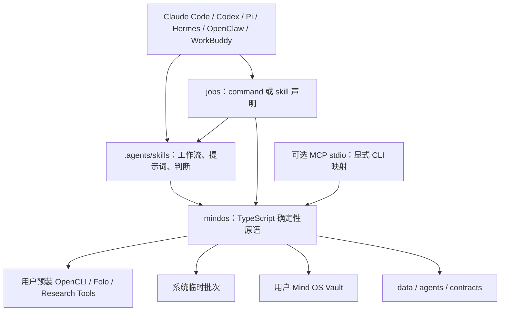
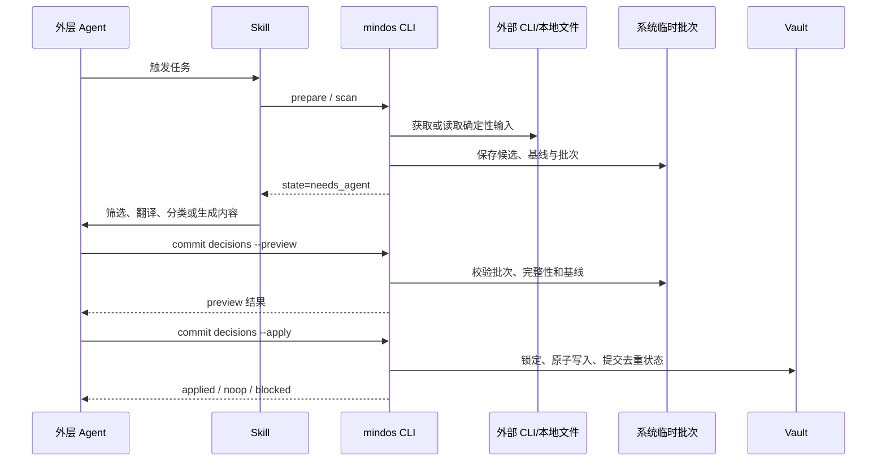
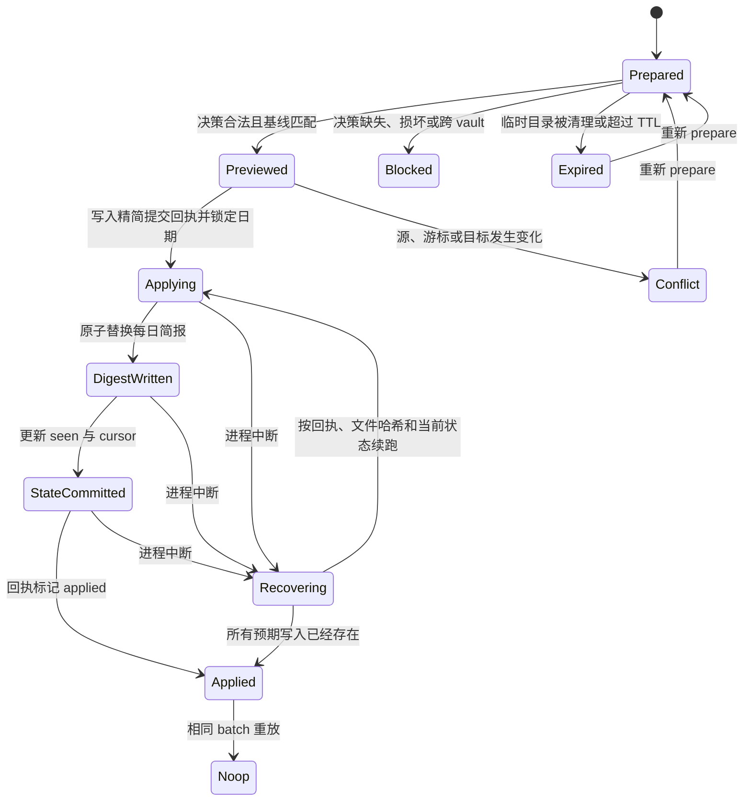

# Mind OS Builder Skill-First Simplification - Plan

## Goal Capsule

- **目标：**把当前 Python 平台收缩为一套可直接阅读、安装和组合的 Skill-first Mind OS 构建套件，用 TypeScript 薄 CLI 承担确定性准备、校验与提交。
- **交付形态：**顶层 Skills、Agents、Jobs、数据模板和文档仍是产品主体；`mindos` 是 npm 安装的确定性执行工具；MCP 是可选 stdio 适配器。
- **权威顺序：**本计划取代旧计划中关于 Python 领域核心、Action Registry、RunEnvelope、JobRunner 和内置多模型 Research Runtime 的架构决定；旧计划保留为历史基线。
- **执行方式：**先用黑盒契约测试冻结必须保留的用户行为，再迁移确定性能力，最后一次性删除 Python 运行时，不维护双栈兼容层。
- **停止条件：**若 TypeScript 实现无法保持路径边界、原子写入、两阶段基线、去重或 npm 资产安装，停止切换并修复缺口，不以减少代码为由降低数据安全。
- **完成条件：**npm 安装、Agent 安装、离线完整旅程、可选 MCP、发布审计和目标代码规模全部通过后，才删除最后一份 Python 运行时代码。

---

## Product Contract

### Summary

本计划把 Mind OS Builder 重构为“开放 Skills + 声明式 Jobs + 确定性薄 CLI”。外层 Agent 负责语义判断、翻译、分类、研究编排和内容生成；CLI 只负责可重复验证的文件、状态、外部 CLI、结构校验与提交操作。

### Problem Frame

当前仓库的公开目录已经接近目标形态，但 `src/mind_os_builder/` 同时承担 CLI、应用分发器、Action Registry、Job Runtime、MCP Server、Provider Runtime、统一状态机和领域逻辑，共有约 6376 行 Python。用户要理解的是如何搭建和运行 Mind OS，而不是先理解一个通用 Agent 平台。

这种结构把 Skill 能表达的工作流重复实现进 Python，也让 Tech Research、Jobs 与 MCP 反向塑造核心。结果是顶层目录虽然直观，真正行为却隐藏在 `src/` 的平台抽象里；新增或修改一个流程需要同步 Registry、Dispatcher、RunEnvelope、MCP、Job 和测试。

重构不追求把 6376 行逐行翻译成 TypeScript。它保留确定性安全边界和已经跑通的用户旅程，删除平台运行时，把工作流重新放回 Skills、提示词和外层 Agent。

### Actors

- A1. **知识工作者：**希望从空目录初始化 Wiki、采集资料、管理书籍并运行 Distill、Research 和 Radar，不需要理解项目内部模块。
- A2. **Agent 工具用户：**使用 Claude Code、Codex、Pi、Hermes、OpenClaw 或 WorkBuddy，希望复制一段安装指令后获得同一组 Skills 与 `mindos` CLI。
- A3. **贡献者：**希望修改一个 Skill、Provider 适配或确定性命令，而不必扩展 Registry、调度器或统一状态机。

### Requirements

**产品形态与语言**

- R1. `.agents/skills/`、`agents/`、`data/`、`docs/`、`jobs/` 和 `scripts/` 必须继续作为一眼可读的规范目录，安装包中的副本只能是发布产物。
- R2. 确定性 CLI 必须迁移为 TypeScript 单运行时，基线为 Node.js 24 LTS，通过 npm 单包发布并继续暴露 `mindos` 命令；首版只认证 macOS，Linux 与 Windows 延后。
- R3. 首个 TypeScript 发布物不得依赖 Python、`uv`、Python wheel、Python 模块 API 或 TypeScript/Python 桥接层。
- R4. 核心生产 TypeScript 代码目标不超过 2500 行；超过上限必须先证明新增代码属于确定性安全或业务行为，而不是恢复通用平台抽象。

**CLI 与安全边界**

- R5. 所有 CLI 命令必须输出一个简化、版本化的 JSON 结果，保留 `ok`、`state`、`changed`、`artifacts`、领域 `data` 和稳定 `error`，删除队列、取消、超时、统一 metrics 与通用运行状态机。
- R6. 所有写操作必须默认 preview，只有显式 `--apply` 才能修改目标；目标根校验、符号链接逃逸防护、受保护目录、单文件原子替换、操作级锁、基线哈希、逻辑恢复和幂等检查不得降级。
- R7. 跨 Agent 判断的候选批次必须进入按用户与 vault 隔离的系统临时目录；只有不含原始候选的精简提交回执可以进入 `.mindos/`，用于锁定日期、记录提交阶段和恢复部分写入，不建设通用 checkpoint Runtime。
- R8. CLI 不得直接调用模型或内置提示词正文；提示词只维护在对应 Skill 的 `prompts/`，Agent 生成的结构化结果始终视为不可信输入。

**能力边界**

- R9. Wiki 初始化与 lint、Book Base 初始化与校验继续由 CLI 确定性执行；Books 作为 `mind-os` Skill 的初始化分支，不增加无判断价值的独立 Skill。
- R10. Twitter 必须使用 OpenCLI，RSS 必须完全使用 Folo CLI；两者都作为用户预装、预认证的外部依赖，Builder 只做 doctor、调用、超时、规范化、过滤、去重与提交。
- R11. Twitter 与 RSS 必须遵循 `prepare → Skill/Agent 判断 → commit`；筛选、必要翻译、摘要、分类和决策组装属于 Skill，游标、已见状态、日期锁定和每日文件提交属于 CLI。
- R12. Distill 必须遵循 `scan → Agent 角色处理 → commit`，Radar 必须遵循 `prepare → Agent/人确认 → commit`；CLI 不生成角色回复，也不自动搬运或归档 Radar 页面。
- R13. Tech Research 必须保留现有证据收集、交叉核验、反方审视、综合和报告模板，但由 Skill 调用宿主已有的 Web、MCP 或 Provider 工具；CLI 只校验并提交候选报告，不读取 Provider API Key、不直接调用模型。

**Jobs、MCP 与安装**

- R14. Jobs 必须继续是声明式 YAML，但只描述受限 `mindos` argv 数组或 `skill` 入口、声明式输入、effects、并发键、重试与 schedule hint；宿主不得把 Job 当 shell 字符串执行，项目不提供 `job run`、线程池、取消、恢复或必选调度器。
- R15. MCP 必须是可选本地 stdio 适配器，显式映射少量稳定 CLI 原语并转发同一 JSON 结果；不得恢复 Action Registry、领域 Dispatcher 或远程传输。
- R16. 用户必须可以通过 `npm install -g` 安装 CLI，或把一段安装指令发给 Agent；Skill 安装继续支持 preview、显式 apply、冲突不覆盖、宿主原生目录和 Distill 角色物化。

**验证与公开发布**

- R17. 测试必须以 CLI 黑盒、文件系统结果、Skill 契约和 npm 安装包为中心，不保留对内部模块结构的兼容要求。
- R18. CI 必须离线完成；OpenCLI、Folo、Obsidian 和真实研究工具只在用户显式启用时烟测，凭证、私人路径和真实内容不得进入测试产物。
- R19. 发布审计必须拒绝 Python 运行时残留、私人绝对路径、凭证形态、真实 vault 数据、重复提示词和 npm 包中的意外文件。

### Key Flows

- F1. **安装并初始化**
  - **触发：**A1 直接安装 npm 包，或 A2 把安装指令交给 Agent。
  - **步骤：**安装 `mindos`，运行 doctor，preview 安装宿主 Skills，显式 apply，再对用户指定的新目录 preview/apply Wiki 初始化。
  - **结果：**CLI、Skills 和最小 Wiki 可用；已有 Skill、现有 vault 或缺失外部依赖不会被静默覆盖。
- F2. **采集 Twitter 或 RSS**
  - **触发：**A1/A2 调用对应 Skill 或声明式 Job。
  - **步骤：**CLI 调用 OpenCLI/Folo 生成临时候选；Agent 筛选、翻译、摘要和分类；CLI 校验完整决策并 preview/apply 每日简报、seen、cursor 和提交日期状态。
  - **结果：**重复运行不重复内容，批次失效时重新 prepare，外部 CLI 认证和安装仍归用户所有。
- F3. **处理 Distill 与 Radar**
  - **触发：**日记出现角色标签，或 Radar 页面到达复查日期。
  - **步骤：**CLI 扫描并返回基线与候选；Agent 生成角色回复或逐项决定；CLI 只提交匹配基线且明确批准的结果。
  - **结果：**Agent 不能越过受保护目录或把过时决定写入已变化页面。
- F4. **完成 Tech Research**
  - **触发：**A1/A2 调用 `tech-research` Skill。
  - **步骤：**Skill 探测宿主可用研究工具，按模式收集与交叉核验，生成 vault 外候选报告；CLI preview 校验来源与目标，再 apply 到 `raw/research/`。
  - **结果：**没有可用工具时明确停止；任何模型草稿都不能绕过最终校验直接写入 vault。
- F5. **由任意宿主执行 Job**
  - **触发：**Agent、cron 或其他运行层读取 `jobs/*.yaml`。
  - **步骤：**运行层解析 command/skill 入口、注入输入、遵守 effects 与 schedule hint，并消费 CLI JSON 或 Skill 完成信号。
  - **结果：**仓库不持有任务线程、取消状态或调度器；同一 YAML 可被不同宿主翻译执行。
- F6. **通过 MCP 调用**
  - **触发：**用户选择安装 MCP 可选依赖并启动本地 stdio Server。
  - **步骤：**MCP 固定 vault 根，显式工具调用同一 `mindos` 原语，捕获并转发 JSON；协议 stdout 不输出日志。
  - **结果：**MCP 不产生第二套领域行为，未安装可选依赖不影响 CLI 与 Skills。

### Acceptance Examples

- AE1. 给定一个 npm tarball 和空临时前缀，安装后可以运行 `mindos doctor --json`，包内 Skills、Agents、Jobs 和 Data 均可解析，进程不需要 Python。
- AE2. 给定 Claude Code、Codex、Pi、Hermes、OpenClaw 或 WorkBuddy 目标，Skill 安装 preview 不写入，apply 后复制规范内容，重复 apply 为 noop，不同内容的同名 Skill 和项目级符号链接目标会阻止整个安装。
- AE3. 给定空目录，Wiki 初始化 preview 前后目录不变；apply 生成完整骨架；第二次 apply 为 noop；未知同名文件不被覆盖。
- AE4. 给定 OpenCLI/Folo fixture，采集 prepare 返回 `needs_agent` 和临时批次；完整决策可 preview/apply；缺项、未知 ID、过期批次、跨 vault 批次和基线变化均被拒绝。
- AE5. 给定同一采集批次在午夜前生成、午夜后重试，CLI 锁定首次提交日期，不向第二个每日文件重复写入；相同 apply 重放为 noop。
- AE6. 给定 Distill 多角色标签，scan 返回角色与并发提示，Agent 回复通过 commit 幂等追加；源文件在 scan 后变化时返回冲突，不尝试自动合并。
- AE7. 给定三个 Radar 建议且只批准一个，commit 只标记已批准项；全部拒绝为 noop；不会自动移动、归档页面或修改 `wiki/insights/`。
- AE8. 给定带来源的候选研报，research preview 不写 vault，apply 原子提交到 `raw/research/`；缺少来源、非法目标、符号链接和重复目标被拒绝；没有研究工具时 Skill 不生成伪完成报告。
- AE9. 给定任意 Job YAML，一个不导入项目代码的合成宿主可以解析其 command/skill 入口和输入；不存在的入口、未声明变量或非法结构在执行前失败。
- AE10. 给定同一离线输入，MCP 返回的状态、变更标志、产物和领域数据与直接 CLI 等价；MCP 未安装时所有非 MCP 命令仍正常工作。

### Success Criteria

- 一个新用户只看 README 和安装指令，可以从 npm 安装到最小 Wiki，不需要 Python、`uv` 或仓库内部知识。
- Twitter/OpenCLI、RSS/Folo、Books、Distill、Tech Research、Radar 和 Jobs 均有一条离线可复现旅程；真实烟测有明确的手动开关。
- `.agents/skills/` 是唯一工作流与提示词规范源，生产代码中没有提示词正文、模型客户端或 Provider Key 配置。
- `src/` 的生产 TypeScript 代码不超过 2500 行，核心 Runtime 依赖不超过三个，不存在 Registry、Dispatcher、JobRunner 或通用 RunStore。
- npm tarball 安装、Skills 安装、完整旅程、MCP 可选安装与发布审计全部通过。

### Scope Boundaries

#### In Scope

- TypeScript/Node.js 24 LTS CLI、npm 单包发布、Node 内置测试运行器和黑盒 CLI 测试。
- Wiki、Books、Twitter/OpenCLI、RSS/Folo、Distill、Research commit、Radar 和 Skill 安装的确定性能力。
- Skills、Agents、Jobs、配置、合成夹具、宿主适配文档和可选本地 MCP stdio。
- 一次性破坏性切换：行为契约迁移完成后删除全部 Python 运行时、Python 测试和 wheel 发布配置。

#### Deferred to Follow-Up Work

- Bun 单文件可执行、Homebrew formula、Linux/Windows 安装认证、文件锁验证和代码签名。
- MCP v2、Streamable HTTP、远程认证、托管服务和自动生成全部 MCP tools。
- 内置 Tavily、Exa、Perplexity、OpenRouter、Gemini 或 Brave HTTP 客户端；只提供外部工具接入说明。
- 第三方 Provider 插件系统、动态发现、通用 workflow DSL 和 Job 执行引擎。
- 批次跨主机恢复、持久队列、后台守护进程、通知和通用 checkpoint/resume。

#### Outside This Product's Identity

- 在确定性脚本中调用模型、替代外层 Agent 做语义判断，或把某一模型/Agent/调度器设为唯一运行时。
- 自动安装、登录或保存 OpenCLI、Folo、研究 Provider、OAuth、Cookie 或 API Key。
- 公开私人 vault、真实日记、真实采集结果、过滤名单、凭证或 `wiki/insights/`。
- 为兼容未公开的 Python 模块 API 而保留双运行时、桥接进程或第二套业务实现。

### Dependencies and Sources

- Node.js 24 是本计划的 LTS 基线；Node 官方说明生产应用应采用 LTS，2026-07 时 v24 与 v22 仍受支持，而 v26 尚为 Current：[Node.js Releases](https://nodejs.org/en/about/previous-releases)。
- Node.js 已稳定支持可擦除 TypeScript 语法，但发布物仍编译为 JavaScript 并进行独立类型检查：[Node.js TypeScript](https://nodejs.org/dist/latest/docs/api/typescript.html)。
- npm 的 `package.json` `bin` 与 `files` 是 `mindos` 命令和规范资产的发布入口：[npm package.json](https://docs.npmjs.com/cli/v11/configuring-npm/package-json/)。
- MCP TypeScript SDK 主分支仍在推进 v2，官方在当前日期建议生产使用 v1.x；本计划隔离并锁定 v1 适配层：[MCP TypeScript SDK](https://github.com/modelcontextprotocol/typescript-sdk)。
- `uv tool install` 已能提供良好的 Python CLI 体验，但仍引入独立工具环境与 Python 版本生命周期；它是可行的低风险备选，不是目标发行面：[uv Tools](https://docs.astral.sh/uv/concepts/tools/)。
- Bun 可生成包含运行时与资产的跨平台单文件可执行，但会引入独立构建、签名和发布矩阵，因此延期：[Bun Single-file Executable](https://bun.sh/docs/bundler/executables)。

---

## Planning Contract

### Key Technical Decisions

- KTD1. **以 TypeScript 替换 Python，而不是只给 Python 平台做减法。**仓库尚未公开发布，确定性能力主要是文件、JSON/YAML、子进程与 HTTP 边界，Node/npm 更符合目标 Agent 工具的安装生态；迁移发生在删除平台层之后，不做等量翻译。
- KTD2. **Skill-first 是产品架构，不是文档口号。**Skills 持有工作流、判断步骤和提示词；CLI 只持有可测试的确定性原语。`(session-settled: user-approved — chosen over a Python domain platform that centrally orchestrates every capability: the repository should remain directly understandable to agent harnesses)`
- KTD3. **脚本不直接依赖模型。**Tech Research 与采集的语义工作全部交给外层 Agent；CLI 只接收候选或结构化决定并验证提交。`(session-settled: user-directed — chosen over embedding LLM clients in scripts: the outer agent owns judgment and model access)`
- KTD4. **Node.js 24 LTS + npm 是唯一必需运行时。**开发期使用 TypeScript，发布物由 `tsc` 生成 ESM JavaScript；核心 Runtime 依赖限定为 Commander、YAML Parser 与 Ajv，其他工具只作为开发依赖或 MCP optional dependency，不要求 Bun、Deno、tsx 或全局 TypeScript。
- KTD5. **保留小型 CLI 结果契约，不保留 RunEnvelope。**`preview`、`applied`、`noop` 和 `needs_agent` 是 `ok: true` 的正常状态；`blocked` 与 `failed` 是 `ok: false` 且必须带稳定错误码。错误码按 input、state、dependency、provider 与 filesystem 命名空间组织；每个 staged 命令在契约中声明 Agent 应确认、重试、重新 prepare 或停止。
- KTD6. **不建设新的运行时 Action Registry。**CLI 子命令是公开动作；静态 commands 描述、JSON Schema、Job YAML 与 MCP 映射表是版本化发布资产，只提供发现与一致性校验，不导入领域函数或承担运行时分发。
- KTD7. **OpenCLI 与 Folo 是前置依赖。**Twitter 只通过 OpenCLI，RSS 只通过 Folo；doctor 负责报告是否可用，项目不自动安装或认证。`(session-settled: user-directed — chosen over bundling source clients or a generic RSS parser: external CLIs own acquisition and authentication)`
- KTD8. **候选批次短命，提交回执持久。**临时批次默认保留 24 小时并限制为当前用户读取；apply 在单一 collection commit 锁内先写精简回执，再依次原子替换简报、seen、cursor，最后把回执标成 applied。30 天内的重放以回执和文件哈希恢复或返回 noop；候选与回执都过期后重新 prepare。这是采集专用逻辑事务，不是通用 checkpoint Runtime。
- KTD9. **Jobs 只是可移植入口声明。**Job 可指向 command 或 skill，但没有项目自带执行器、线程状态或调度安装。`(session-settled: user-directed — chosen over bundling a scheduler runtime: users adapt jobs to their existing agent tools)`
- KTD10. **Tech Research 保留方法与结果契约，删除内置 Provider Runtime。**Tavily、Exa、Perplexity、OpenRouter、Gemini 和 Brave 通过宿主工具、外部 MCP 或 CLI 接入；仓库只维护提示词、核验规则、工具能力说明和 report commit。
- KTD11. **MCP 同版交付但不阻塞核心。**使用当前生产推荐的 TypeScript SDK v1.x，本地 stdio、固定 vault 根、显式工具表；SDK 放入 npm `optionalDependencies` 并通过动态加载隔离，`--omit=optional` 安装时只有 MCP 命令不可用。
- KTD12. **一次性切换，不维护双运行时。**先建立 TypeScript 黑盒等价证据，再在同一发布切面删除 Python 包、测试、脚本和文档。`(session-settled: user-approved — chosen over a long-lived Python/TypeScript compatibility layer: old internal APIs are not public contracts)`

### High-Level Technical Design

#### Component Topology



#### Staged Agent Workflow



#### CLI Result Semantics

| State | `ok` | Agent next action |
|---|---:|---|
| `preview` | true | 展示变更并取得 apply 授权 |
| `applied` | true | 记录产物并结束当前步骤 |
| `noop` | true | 视为幂等成功，不重复调用 |
| `needs_agent` | true | 读取领域 data，执行对应 Skill 判断后提交 |
| `blocked` | false | 按稳定错误码修正输入、依赖或重新 prepare |
| `failed` | false | 停止自动重试，报告未预期运行错误 |

#### Temporary Batch Lifecycle



### Output Structure

```text
.agents/skills/              规范 Skills 与独立 prompts/references
agents/                      客户端中立角色契约
adapters/                    各宿主安装与配置示例
contracts/                   CLI 命令描述、结果/决策 Schema 与 MCP 映射
data/                        Wiki、Books、配置与合成 fixture
docs/                        从零教程、Provider 前置依赖与架构
jobs/                        command/skill 声明，不含执行器
scripts/                     TypeScript 发布审计与烟测入口
src/
  cli.ts                     mindos 命令入口
  commands/                  按用户能力组织的薄命令
  lib/                       路径、原子写入、锁、资产、结果、子进程
  collect/                   批次、过滤、去重、游标与逻辑提交回执
  distill/                   扫描、响应校验与提交
  radar/                     候选生成与逐项提交
  mcp/                       可选 stdio CLI 适配
tests/                       TypeScript 单元、契约、集成、E2E 与 live
package.json
tsconfig.json
```

### Alternatives Considered

- **保留 Python，只删除平台层：**迁移风险最低，现有确定性代码和测试可直接保留；但用户仍需接受 `uv/Python` 安装面，且当前未公开阶段是最后一个低成本统一到目标生态的窗口。
- **Bun-first 单文件可执行：**安装体验更独立，也能嵌入资产；但它把跨平台构建、签名和 Bun 运行时兼容变成首版责任，偏离“npm 安装 + Agent 安装”的主路径。
- **Python 与 TypeScript 双栈过渡：**可降低一次性切换压力，但会复制资产定位、错误契约和测试矩阵，直接违背本次减法目标。
- **保留完整 Provider Runtime：**能还原当前 key-based Research，但会继续让脚本直接调用模型并拥有提示词装配，违背已确认的外层 Agent 判断边界。

### System-Wide Impact

- 所有 Skills、教程、Jobs、MCP 配置、示例和测试都依赖当前 RunEnvelope 与 Python 安装语法，必须与 CLI 结果契约在同一切换中更新。
- npm 包必须携带点目录 `.agents/skills/` 和其他规范资产；源码检出与安装包都必须通过同一个资产解析接口，不能复制维护。
- 当前 RSS 通用解析器与“RSS 完全依赖 Folo”的用户决策冲突，必须删除解析器和相应文档/测试，不能把 Folo 继续标成未接入的实验 Provider。
- 当前 Tech Research 的 key、模型、重试和 Provider HTTP 代码将全部退出核心配置；文档改为说明如何给宿主配置外部工具以及缺少工具时的停止行为。
- 当前未提交的 Twitter staged-flow 改动是行为参考而不是必须保留的代码；执行时应先用黑盒场景固定它，再删除 Python 实现。
- CLI、Skill、Job 与 MCP 共享静态命令描述和 schema 版本，但运行时依赖方向保持单向：Skills/Jobs/MCP 可以读取契约资产，CLI 领域模块不能反向读取这些适配层。

### Risks and Mitigations

- **文件锁跨平台语义变化：**Node 标准库没有等价于当前 Python 文件锁的统一高层 API；首版只认证 macOS，使用原子创建锁文件、所有者元数据、受控陈旧锁回收，并以多进程测试证明行为。
- **多文件提交无法物理原子：**采集在一个操作级锁内使用精简提交回执和固定写入顺序形成可恢复逻辑事务；对简报、seen、cursor 和回执每个边界进行故障注入，不宣称四个文件同时落盘。
- **npm 点目录或资产漏包：**使用 `files` 白名单和 `npm pack` 安装测试检查 tarball 内容，不依赖开发仓库相对路径猜测。
- **TypeScript 重写发生行为漂移：**每个能力先建立 CLI 黑盒与文件快照测试，迁移期间不以内部函数逐一对应作为完成标准。
- **临时批次被清理：**未开始 apply 时返回 `state.batch_expired` 并重新 prepare；已有提交回执时按回执恢复或收敛为 noop，不承诺跨主机恢复。
- **Job 被错误当成 shell：**Job schema 只允许隐含 `mindos` 的 argv 数组和已声明变量，不接受 shell 字符串、管道或重定向；apply 授权由宿主根据 effect 单独注入。
- **MCP SDK 临近 v2 切换：**适配层限定在一个目录并锁定 v1.x；v2 单独迁移，不让 SDK 类型进入 CLI 领域代码。
- **外部 Research 工具差异：**Skill 按能力而不是厂商 API 组织步骤，fixture 使用标准化工具转录；缺少引用或无法核验时停止提交。

---

## Implementation Units

### U1. Freeze the public contract and establish the Node package

- **Goal:**建立 TypeScript/npm 发布骨架和新的最小 CLI、Job、Agent 决策契约，在迁移业务代码前冻结用户可见行为。
- **Requirements:**R1-R5、R14、R17、R19；KTD1、KTD4-KTD6、KTD12。
- **Dependencies:**无。
- **Files:**创建 `package.json`、`package-lock.json`、`tsconfig.json`、`eslint.config.js`、`contracts/commands.yaml`、`contracts/cli-result.schema.json`、`contracts/job.schema.json`、`contracts/collection-decisions.schema.json`、`contracts/distill-responses.schema.json`、`contracts/radar-decisions.schema.json`、`contracts/research-report.schema.json`、`tests/contract/cli-result.test.ts`、`tests/contract/command-descriptor.test.ts`、`tests/contract/job-schema.test.ts`、`tests/contract/repository-layout.test.ts`、`tests/fixtures/migration/`；修改 `AGENTS.md`、`docs/directory-contract.md`。
- **Approach:**Node 24 LTS、ESM、`tsc` 编译、Node 内置测试运行器；`package.json` 暴露 `mindos` bin，并用 `files` 白名单包含规范资产。静态 commands 描述公开子命令、schema 版本、effects 和 Agent 下一步，不参与运行时分发；黑盒 fixture corpus 保存输入、stdout JSON、退出码、vault 快照、临时状态摘要和错误语义。
- **Execution note:**先将现有 Python CLI 的必须保留场景表达成语言无关的 fixture 与结果测试，不复制 Python 内部模块接口；U3-U7 必须复用同一 corpus。
- **Patterns to follow:**顶层资源唯一规范源；现有 `tests/contract/test_repository_layout.py` 和 `tests/contract/test_skill_spec.py` 的公开边界意图。
- **Test scenarios:**
  - 合法的 preview、applied、noop、needs_agent、blocked、failed 结果通过 schema；`ok` 与 state 不匹配、缺失版本/变更字段、成功结果带 error 或失败结果缺 error 被拒绝。
  - 每个 staged command 描述稳定错误码与 Agent 下一步；Skill 引用不存在的命令、字段或 schema 版本时契约测试失败。
  - command Job 和 skill Job 分别通过 schema；shell 字符串、管道、同时声明两种入口、未知输入绑定或未声明 effect 被拒绝。
  - migration corpus 覆盖 Wiki、Books、Twitter、Folo、Distill、Radar 与 Research commit 的成功、preview、noop、冲突和依赖失败，不调用 TypeScript 内部模块。
  - npm 文件白名单包含 `.agents/skills/`、`agents/`、`adapters/`、`contracts/`、`data/`、`jobs/`，不包含私人路径、Python cache 或测试 fixture 之外的原始内容。
- **Verification:**Node 包能构建出可执行的占位 `mindos --help`；所有新 schema 与仓库布局测试通过；尚未切换业务命令。

### U2. Implement the deterministic CLI and filesystem foundation

- **Goal:**建立所有命令共享的最小路径、写入、锁、资产、结果和外部 CLI 基础，让后续领域迁移不依赖平台 Dispatcher。
- **Requirements:**R5-R8、R17-R19；KTD2-KTD6。
- **Dependencies:**U1。
- **Files:**创建 `src/cli.ts`、`src/lib/result.ts`、`src/lib/paths.ts`、`src/lib/write.ts`、`src/lib/lock.ts`、`src/lib/assets.ts`、`src/lib/subprocess.ts`、`src/lib/config.ts`、`src/commands/doctor.ts`、`tests/unit/paths.test.ts`、`tests/unit/write.test.ts`、`tests/unit/lock.test.ts`、`tests/unit/subprocess.test.ts`。
- **Approach:**命令直接调用小型领域函数，不经过 Dispatcher；所有写入使用统一的根目录解析、单文件原子替换和明确的操作锁。外部 CLI 调用只接受 argv 数组，按白名单提取结果和错误，不拼接 shell。
- **Patterns to follow:**当前 `core/write_guard.py`、`core/read_guard.py`、`core/locks.py` 的安全行为；当前 Provider 子进程适配的超时与脱敏意图。
- **Test scenarios:**
  - 目标包含 `..`、绝对路径、受保护目录、文件符号链接或父目录符号链接时拒绝写入。
  - 原子写入在目标已变化、磁盘错误或并发锁竞争时保留旧内容和可重试状态。
  - 外部命令缺失、超时、非零退出、无效 JSON 和超量输出转换为稳定 dependency/provider 错误，stderr、Cookie、token 和 URL 凭证不进入结果。
  - macOS 多进程竞争、陈旧锁和非所有者锁回收符合安全规则；未认证平台由 doctor 明确报告。
- **Verification:**`mindos doctor --json` 从 npm 安装环境运行；路径、写入、锁、资产解析和子进程测试通过，领域模块可以只依赖这些原语。

### U9. Migrate Skill installation and packaged assets

- **Goal:**用 TypeScript CLI 迁移六类宿主的 Skill 安装和 npm 资产分发，不把安装逻辑混入领域基础。
- **Requirements:**R1、R16-R19；KTD2、KTD4、KTD12。
- **Dependencies:**U1、U2。
- **Files:**创建 `src/commands/skills-install.ts`、`tests/integration/skills-install.test.ts`、`tests/integration/package-assets.test.ts`；修改 `docs/install-with-agent.md`、`adapters/*/README.md`、`package.json`。
- **Approach:**安装器从源码或 npm 包解析同一规范资产，保留 preview/apply、宿主原生路径、冲突不覆盖、符号链接防护和 Distill 角色物化；不自动初始化 vault 或安装外部 Provider。
- **Patterns to follow:**当前 `scripts/install_harness.py` 与 `tests/integration/test_harness_installer.py` 的可观察安装行为。
- **Test scenarios:**
  - 对六类宿主执行 project/user scope preview、apply 和重复 apply；Hermes 不支持的 project scope 返回稳定错误。
  - 同名不同内容、额外文件、目标并发创建和项目级符号链接逃逸阻止覆盖；中断后不留下可见的半安装目录。
  - Distill 安装物包含与 `agents/roles/` 一致的角色 references；其他 Skills 不复制无关资产。
  - 从源码与 `npm pack` tarball 安装后的规范资产摘要一致。
- **Verification:**`mindos skills install ... --json` 在 npm 安装环境通过六宿主矩阵；安装单元可独立于 Wiki/Collect 等领域迁移验收。

### U3. Migrate Wiki and Book Base deterministic commands

- **Goal:**迁移最小 Wiki 初始化/lint/受控 ingest/query 与 Book Base 初始化/校验，证明薄 CLI 可以覆盖纯本地知识能力。
- **Requirements:**R5、R6、R9、R17-R19；KTD5、KTD6。
- **Dependencies:**U2。
- **Files:**创建 `src/commands/wiki.ts`、`src/commands/books.ts`、`src/wiki/init.ts`、`src/wiki/lint.ts`、`src/wiki/pages.ts`、`src/books/init.ts`、`src/books/validate.ts`、`tests/integration/wiki.test.ts`、`tests/integration/books.test.ts`；修改 `.agents/skills/mind-os/SKILL.md`、`.agents/skills/wiki-ingest/SKILL.md`、`.agents/skills/wiki-query/SKILL.md`、`docs/getting-started/01-core-wiki.md`、`docs/getting-started/03-books.md`。
- **Approach:**保留现有目录模板、frontmatter、wikilink、索引和日志规则；Books 继续是确定性模块，由 `mind-os` Skill 引导，不引入新的 Agent 判断协议。
- **Patterns to follow:**当前 `wiki/init.py`、`wiki/lint.py`、`wiki/actions.py`、`books/init.py`、`books/validate.py` 的可观察文件行为。
- **Test scenarios:**
  - 空目录初始化 preview 零写入，apply 生成合法 Wiki，重复 apply 为 noop，未知文件冲突时不部分写入。
  - lint 检查缺失 frontmatter、断链、孤页、红链、超长页、索引缺失和受保护目录，不修改文件。
  - ingest 在基线匹配时 preview/apply 更新页面、索引和日志；哈希冲突、非法目标和 insights/logseq-import 写入被拒绝。
  - Books preview/apply/noop、用户同名文件冲突、Base 过滤范围与合成书页校验保持一致。
- **Verification:**从 npm 安装环境完成空目录 Wiki + Books 旅程；现有 Python 实现尚保留作对照但不再作为新测试入口。

### U4. Migrate staged Twitter and Folo RSS collection

- **Goal:**把采集收敛为 OpenCLI/Folo Provider 加共享的 prepare/Agent/commit 协议，删除内置 RSS 网络解析和脚本内语义判断。
- **Requirements:**R5-R8、R10、R11、R17-R19；KTD3、KTD7、KTD8。
- **Dependencies:**U2、U3。
- **Files:**创建 `src/commands/collect.ts`、`src/collect/providers/opencli.ts`、`src/collect/providers/folo.ts`、`src/collect/batch.ts`、`src/collect/filter.ts`、`src/collect/decisions.ts`、`src/collect/state.ts`、`src/collect/receipt.ts`、`src/collect/commit.ts`、`.agents/skills/rss-digest/SKILL.md`、`.agents/skills/rss-digest/prompts/select.md`、`.agents/skills/rss-digest/prompts/translate-summarize.md`、`.agents/skills/rss-digest/prompts/classify.md`、`.agents/skills/rss-digest/prompts/assemble-decisions.md`、`.agents/skills/rss-digest/references/decision-schema.md`、`.agents/skills/rss-digest/references/output-contract.md`、`tests/contract/collection-decisions.test.ts`、`tests/unit/collect-filter.test.ts`、`tests/unit/collect-state.test.ts`、`tests/unit/collect-recovery.test.ts`、`tests/integration/collect-twitter.test.ts`、`tests/integration/collect-rss.test.ts`；修改 `.agents/skills/twitter-digest/SKILL.md`、`.agents/skills/twitter-digest/prompts/*`、`.agents/skills/twitter-digest/references/decision-schema.md`、`.agents/skills/twitter-digest/references/output-contract.md`、`data/collect/config.yaml`、`jobs/collect-twitter.yaml`、`jobs/collect-rss.yaml`、`docs/getting-started/02-collection.md`、`docs/providers.md`。
- **Approach:**两个 Provider 只转换外部 CLI 输出；共享过滤、临时批次、决策 schema、seen/cursor/date 状态和提交器。apply 使用采集专用回执形成可恢复逻辑事务；回执只保存 hash、日期、阶段和目标，不保存原始候选。来源差异通过配置与规范化字段表达，不建设动态 Provider 插件接口。
- **Execution note:**先用当前 staged Twitter 测试建立行为特征；RSS 按已确认的 Folo-only 契约重新定义，不迁移通用 RSS/Atom HTTP Parser。
- **Patterns to follow:**当前 `collect/twitter_workflow.py`、`collect/decisions.py`、`collect/batches.py`、`collect/seen.py`、`collect/cursors.py`、`collect/commits.py` 的确定性边界；提示词继续独立放在 Skill `prompts/`。
- **Test scenarios:**
  - OpenCLI/Folo 缺失、未认证、超时、非 JSON、字段变化和空结果返回稳定错误，不泄露 stdout/stderr 或凭证。
  - prepare 只写系统临时批次，返回 needs_agent；候选数受 output limit 限制，过滤报告按原因聚合而非携带全部丢弃明细。
  - commit 拒绝缺失或重复 signal、未知分类、错误 baseline、跨 vault、损坏/过期批次；preview 不改 vault 或 cursor。
  - apply 在单一锁内按回执、简报、seen、cursor、applied 回执的顺序推进；对每个写入边界注入中断后，重放使用首次日期和文件 hash 收敛，不产生第二份简报或丢失游标。
  - 临时目录权限只允许当前用户，vault 路径经 hash 隔离；候选超过 24 小时返回 state.batch_expired，30 天内已开始的提交仍可由精简回执恢复。
  - Twitter 与 RSS 使用独立 seen/cursor key；Folo-only 文档和 doctor 不再宣称内置 RSS Parser 可用。
- **Verification:**Twitter 与 RSS fixture 完成 prepare→Skill 决策→preview→apply→replay；live 测试只在显式开关下调用用户已安装的 OpenCLI/Folo。

### U5. Migrate Distill and Radar staged workflows

- **Goal:**保留 Distill 多角色与 Radar 人工确认能力，把两者统一为 Agent 生成候选、CLI 校验提交的薄接口。
- **Requirements:**R5-R8、R12、R17-R19；KTD2、KTD3、KTD5。
- **Dependencies:**U2、U3。
- **Files:**创建 `src/commands/distill.ts`、`src/distill/scan.ts`、`src/distill/responses.ts`、`src/distill/commit.ts`、`src/commands/radar.ts`、`src/radar/parse.ts`、`src/radar/prepare.ts`、`src/radar/decisions.ts`、`src/radar/commit.ts`、`.agents/skills/distill/references/response-schema.md`、`.agents/skills/radar-review/references/decision-schema.md`、`tests/contract/distill-responses.test.ts`、`tests/contract/radar-decisions.test.ts`、`tests/integration/distill.test.ts`、`tests/integration/radar.test.ts`；修改 `.agents/skills/distill/SKILL.md`、`.agents/skills/radar-review/SKILL.md`、`agents/orchestrator.md`、`agents/roles/*.md`、`jobs/distill.yaml`、`jobs/tech-radar.yaml`、`docs/getting-started/04-distill.md`、`docs/getting-started/05-research-and-radar.md`。
- **Approach:**角色内容与 Radar 判断只存在于 Skill/Agents；CLI 返回稳定 trigger/suggestion ID 和 baseline。Distill commit 重新扫描并比对源基线；Radar prepare 创建短命临时建议批次，commit 要求对每个 suggestion 做批准或拒绝决定并重新比对页面基线。
- **Patterns to follow:**当前 `distill/scanner.py`、`distill/apply.py` 的段落定位、marker 和幂等行为；`radar/parser.py` 的结构化日期解析。
- **Test scenarios:**
  - Distill scan 对无标签、单角色、多角色、Ember book slug 和并发提示返回正确候选且不写文件。
  - Distill commit 拒绝未知 trigger、persona 不匹配、缺少回复、baseline 变化和非法 Callout；重复 apply 不重复追加。
  - Radar prepare 对缺日期、未来日期、到期和已标记项生成稳定建议；不修改页面。
  - Radar commit 要求批准/拒绝完整覆盖，在多建议中只应用批准 ID，全部拒绝为 noop；未知/重复 ID、源变化、路径越界和重复提交被安全处理，不自动搬运页面。
  - Distill 与 Radar 的重复 preview、重复 apply、并发 commit、临时批次过期和 preview 后源变化均返回契约规定的下一步。
- **Verification:**五角色合成日记和多建议 Radar 页面均通过 staged E2E；Skill 不引用旧 RunEnvelope 字段或 Python 命令语法。

### U6. Replace the Tech Research runtime with Skill orchestration and report commit

- **Goal:**保留 Tech Research 方法、提示词和可审计报告，删除仓库内 Provider HTTP/模型 Runtime，只新增确定性的报告校验与提交。
- **Requirements:**R5-R8、R13、R17-R19；KTD3、KTD10。
- **Dependencies:**U2、U3。
- **Files:**创建 `src/commands/research.ts`、`src/research/validate.ts`、`src/research/commit.ts`、`tests/integration/research-commit.test.ts`、`tests/contract/tech-research-skill.test.ts`、`tests/fixtures/research/tool-transcript.json`；使用 `contracts/research-report.schema.json`；修改 `.agents/skills/tech-research/SKILL.md`、`.agents/skills/tech-research/prompts/*`、`.agents/skills/tech-research/references/provider-prompts.md`、`.agents/skills/tech-research/references/report-template.md`、`jobs/tech-research.yaml`、`docs/providers.md`、`docs/getting-started/05-research-and-radar.md`、`data/core/.mindos/config.yaml`。
- **Approach:**Skill 以“可用能力”而不是内部 Provider Class 选择证据工具，保留 quick/standard/deep、来源优先级、反方审视与综合阶段；Agent 把候选 Markdown 放在 vault 外，CLI 校验来源区、frontmatter、目标范围和重复提交后再提升。
- **Execution note:**直接删除模型请求、重试、Prompt Loader 和 Key 配置的运行责任；fixture 测试验证 Skill 流程，不模拟各厂商 HTTP API。
- **Patterns to follow:**现有 `.agents/skills/tech-research/` 的提示词模块与报告模板；当前 `research/report.py` 中可观察的报告结构，不迁移 `research/providers/`、`research/http.py` 或 `research/runner.py`。
- **Test scenarios:**
  - Skill 在拥有一种检索工具、多个互补工具、没有工具和工具部分失败时分别完成、降级或停止，并明确证据缺口。
  - 候选报告缺少来源、包含非法 frontmatter、目标越界、写入 protected 目录或经符号链接逃逸时 commit 被拒绝。
  - preview 零写入；apply 原子写入 `raw/research/`；相同内容重复 apply 为 noop；同名不同内容要求显式新目标而不覆盖。
  - 配置、日志、报告和错误中不存在 Provider Key；核心代码不包含 Tavily/Exa/Perplexity/OpenRouter/Gemini HTTP endpoint 或模型调用。
- **Verification:**使用合成工具转录完成 Tech Research Skill→候选报告→preview/apply 旅程；没有任何 Research live test 直接从核心读取 API Key。

### U7. Simplify Jobs and add the optional MCP adapter

- **Goal:**让 Jobs 可被任意宿主解释，同时以最小 MCP stdio 入口证明 CLI 结果可以标准化暴露而不恢复平台层。
- **Requirements:**R5、R6、R14、R15、R17-R19；KTD6、KTD9、KTD11。
- **Dependencies:**U3-U6、U9。
- **Files:**创建 `contracts/mcp-tools.yaml`、`src/commands/jobs.ts`、`src/jobs/catalog.ts`、`src/mcp/server.ts`、`tests/integration/jobs.test.ts`、`tests/contract/job-portability.test.ts`、`tests/contract/mcp-mapping.test.ts`、`tests/integration/mcp.test.ts`、`tests/integration/mcp-package.test.ts`；修改 `jobs/*.yaml`、`jobs/README.md`、`docs/jobs.md`、`docs/action-parity.md`、`docs/agent-adapters.md`、`docs/getting-started/06-agent-adapters.md`、`adapters/*/README.md`、`package.json`。
- **Approach:**Jobs 只由 CLI `list/show` 校验和展示，不执行；entry command 是隐含 `mindos` 的 argv 数组，变量只能引用已声明输入，宿主不得经过 shell。两个独立合成宿主验证相同绑定和结果。MCP 从静态映射表手工选择稳定原语，固定 root，并通过子进程调用已发布 `mindos --json` 以保证结果等价；映射表必须引用 U1 的 commands/schema 版本。
- **Patterns to follow:**当前 Job YAML 的输入、effects、并发键和 schedule hint；当前 MCP stdio 的 stdout/stderr 隔离意图，不迁移 Action Registry 自动生成。
- **Test scenarios:**
  - command Job 与 skill Job 能被两个实现不同的合成宿主解析为相同 argv/Skill 输入；shell 元字符不被解释，缺参、未知入口、非法绑定和未声明 effect 在运行前失败。
  - `mindos jobs list/show` 只读且返回简化 JSON；不存在 `job run`、线程状态、cancel 或 resume。
  - 使用 `--omit=optional` 安装 tarball 时核心命令全部成功，`mindos mcp serve` 返回可操作缺失依赖错误；默认安装时 MCP 可启动。
  - MCP stdio 无日志污染、固定 vault 根不能被工具参数覆盖、默认 preview、显式 apply；每个工具逐字段转发同一 CLI JSON，映射或 schema 版本漂移使契约测试失败。
- **Verification:**六个内置 Job 可由两个合成宿主解析；npm 的 omit-optional 与默认安装两条 tarball 烟测均通过，MCP 与 CLI 契约等价。

### U8. Cut over, delete Python, and prove the public journey

- **Goal:**一次性完成文档、示例、测试和发布切换，删除旧 Python 平台及所有孤儿契约，交付可公开的 TypeScript 版本。
- **Requirements:**R1-R4、R16-R19；KTD1、KTD12。
- **Dependencies:**U1-U7、U9。
- **Files:**删除 `src/mind_os_builder/`、`pyproject.toml`、`uv.lock`、`scripts/install_harness.py`、`scripts/audit_release.py`、`examples/*.py`、全部 `tests/**/*.py`；创建 `scripts/audit-release.ts`、`scripts/smoke.ts`、`examples/offline-full-journey.ts`、`tests/e2e/full-journey.test.ts`、`tests/live/opencli.test.ts`、`tests/live/folo.test.ts`、`tests/live/obsidian-books.test.ts`；修改 `README.md`、`AGENTS.md`、`docs/architecture.md`、`docs/security-and-privacy.md`、`docs/verification/mvp-smoke.md`、`docs/getting-started/*.md`、`scripts/README.md`、`examples/synthetic-vault/README.md`。
- **Approach:**以 npm 安装后的 CLI 为唯一 E2E 入口；清理所有 Python import、uv 命令、RunEnvelope、Action Registry、Dispatcher、JobRunner、RunStore、内置 Research Provider 和通用 RSS Parser 引用。发布审计检查源码、tarball 和文档。
- **Execution note:**只有 U1-U7 与 U9 的黑盒、安装和打包验证全部通过后才删除 Python；删除后重新从空 npm 前缀执行完整旅程，不以开发仓库环境作为证明。
- **Patterns to follow:**当前 `tests/e2e/test_full_journey.py` 的用户旅程覆盖和 `scripts/audit_release.py` 的私人数据审计意图；测试断言改为 CLI 与文件结果，不改写成 TypeScript 内部模块测试。
- **Test scenarios:**
  - 仓库不存在生产 `.py`、`pyproject.toml`、`uv.lock`、Python 命令或 Python compatibility 文档；允许的历史计划引用不被当成运行依赖。
  - 从 `npm pack` tarball 在空前缀安装，使用 U1 的同一 migration corpus 完成 doctor、Skills 安装、Wiki、Books、Twitter、RSS、Distill、Research、Radar、Jobs 和可选 MCP 离线旅程；测试进程不得启动 Python、`uv` 或导入旧模块。
  - 发布审计拒绝主目录、私人仓库路径、密钥形态、真实日记、未允许文件、重复提示词和超出白名单的 tarball 内容。
  - 生产 TypeScript 行数、核心 Runtime 依赖数和禁止架构符号满足成功指标。
- **Verification:**全部质量门通过，旧 Python 入口确实不可用，新用户文档只出现 npm/Node 安装路径，最终 tarball 在独立临时环境通过完整旅程。

---

## Verification Contract

| Gate | Command | Covers | Done Signal |
|---|---|---|---|
| Install | `npm ci` | U1-U9 | 锁文件可重复安装，Node 24 无 peer/engine 阻塞 |
| Type check | `npm run typecheck` | U1-U9 | 严格类型检查零错误 |
| Lint | `npm run lint` | U1-U9 | TypeScript、测试与脚本零 lint 错误 |
| Build | `npm run build` | U1-U9 | ESM CLI、脚本与测试构建成功 |
| Test | `npm test` | U1-U9 | 单元、契约、集成与离线 E2E 全部通过 |
| Package | `npm run test:pack` | U1、U2、U7-U9 | tarball 内容正确，空前缀安装后完整离线旅程通过 |
| Architecture audit | `npm run audit:architecture` | U1、U6-U9 | 无 Python Runtime、Registry/Dispatcher/JobRunner/模型客户端，生产 TS 不超过 2500 行 |
| Release audit | `npm run audit:release` | U2-U9 | 源码与 tarball 无私人路径、凭证、真实内容或意外资产 |
| Live smoke | `MINDOS_RUN_LIVE=1 npm run test:live` | U4、U8 | 用户已配置环境中 OpenCLI、Folo 与 Obsidian 通过，未配置项明确跳过 |

Skill 行为验证额外检查：每个 Skill 引用的命令、结果字段、prompt 和 reference 必须存在；Twitter、RSS、Distill、Research、Radar 的 fixture 旅程必须证明 Agent 判断发生在 CLI 外部；修改 Skill 时不得把提示词复制回 `src/`。

---

## Definition of Done

- U1-U9 的 Requirements、测试场景和 Verification 均有通过证据，且没有未解释的跳过项。
- `mindos` 从 npm tarball 安装运行，CLI-only 与 CLI+MCP 两种安装路径均可验证。
- 顶层规范目录仍是唯一维护入口，npm 包只携带发布副本；六类 Agent 宿主能安装并发现同一组 Skills。
- 所有确定性写路径保持 preview/apply、路径保护、原子性、锁、基线和幂等；任何 Agent 输出都不能直接写 vault。
- OpenCLI、Folo 和研究工具始终由用户安装与认证，核心不保存或打印凭证。
- Tech Research 不再有内置模型/Provider HTTP Runtime，RSS 不再有内置通用 Parser，Jobs 不再有执行器，MCP 不再依赖 Registry。
- Python 包、测试、脚本、wheel 配置和兼容桥全部删除；历史计划可以保留文字记录，但不构成运行依赖。
- 生产 TypeScript 不超过 2500 行，核心 Runtime 依赖不超过三个，所有废弃尝试、死代码和迁移期桥接均已清理。
- README、安装指令、教程、Provider、Jobs、MCP、安全和验证文档只描述最终 TypeScript/Skill-first 架构。
