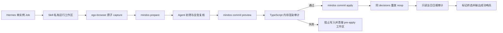
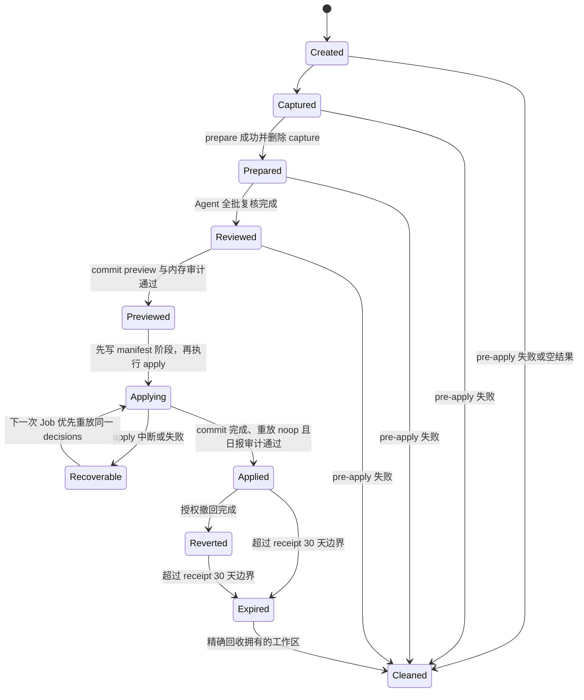

# Twitter Digest 筛选一致性与 Hermes 稳定性修复 - Plan

## Goal Capsule

- **目标：**提高 Twitter Digest 的筛选、翻译和摘要一致性，并消除 Hermes 显式 ego-browser 任务中的临时 Python、运行时路径漂移、审计误判和无主临时文件。
- **职责边界：**Agent 负责语义价值、翻译忠实度和跨候选一致性；TypeScript CLI 只负责可机械证明的输入、输出、结构、编码和状态校验。
- **Provider 边界：**公开 Job 保持 OpenCLI 默认；Hermes 当前私有 Job 保持显式 ego-browser；两者都不得静默回退到另一个 Provider。
- **执行顺序：**先冻结筛选与审计契约，再实现确定性审计和临时生命周期，最后同步 Hermes 并做真实烟测。
- **停止条件：**若修复需要让 CLI 判断内容价值、覆盖未标记人工内容、删除未完成提交的恢复材料，或恢复 Python 运行时，则停止实施并重新评审。
- **完成条件：**同批候选经过两遍筛选与一次全批复核；坏输出在 apply 前被阻止；Hermes 不再生成临时 Python；成功、失败、恢复、撤回和陈旧回收路径均有自动化证据；真实 ego-browser 任务生成简报并通过审计。

---

## Product Contract

### Summary

本计划在现有 ego-browser Provider 和中文质量门修复之上增加三项能力。第一，Twitter Digest Skill 用证据分级、边界案例比较和全批矛盾复核稳定 Agent 的语义判断。第二，仓库内 TypeScript 审计器统一检查提交前渲染结果和已落盘日报，替代 Hermes 临时 Python。第三，Skill 为一次运行建立私有工作区，并按提交阶段清理或保留决策文件，使临时物有明确所有者且不中断恢复与撤回。

### Problem Frame

一个完全合成的 Hermes 故障演练能够生成简报并通过条目数、唯一 ID、中文字段和机械套壳检查，但运行过程仍暴露了四类稳定性问题：Agent 临时生成 Python 审计脚本；解释器编码和硬编码路径失败；重复 ID 审计把同一条目的 marker 与来源 URL 当成两个 ID；宿主把合法 UTF-8 Markdown 误判为二进制。演练结束后还留下了合成的 capture、prepare、decisions 和临时审计脚本 fixture。

任意一次演练的保留比例本身不能证明筛选过严或合理。固定通过率会奖励批次级配额，而不是内容价值。需要改进的是同一证据尺度下的判断一致性，以及对边界保留项、边界拒绝项和翻译结果的复核能力。

### Actors

- A1. **Hermes 定时任务：**在无人值守状态下显式使用 ego-browser，完成采集、Agent 判断、提交、审计、恢复和终态信号。
- A2. **Mind OS 使用者：**阅读中文简报，并在质量事故发生时用原决策文件预演和执行撤回。
- A3. **维护者：**在公开仓库中维护 Provider 中立的 Skill、确定性 CLI 和合成测试，不提交私人路径、真实采集内容或 Hermes 私有配置。

### Requirements

#### 筛选与翻译一致性

- R1. 每个候选必须先独立判断并记录证据等级、理由代码、具体证据和边界标记；这些字段只属于 Agent 中间产物，不扩展最终 decisions v1。
- R2. 证据等级只能作为一致性比较依据，不能自动决定 keep/discard，也不能形成固定最低保留数、最高保留数或目标通过率。
- R3. 初筛后必须比较同主题的边界 keep/discard；若较弱证据被保留而较强证据被拒绝，Agent 必须统一决定或记录候选特有的例外理由。
- R4. 组装最终 decisions 前必须做全批复核，覆盖筛选尺度、标题与摘要的事实忠实度、非中文原文的实际中文翻译、分类和已知机械套壳。
- R5. 最终 decisions 必须继续符合现有 v1 契约；CLI 不接收证据等级，也不判断语义价值或翻译是否忠实。
- R26. 一次复核支持当前 Provider 契约的最多 100 个去重候选；超出单次上下文时必须分片输出统一尺度摘要和全部边界项，最终一轮同时比较所有分片摘要与边界项。
- R27. 筛选改造必须用固定合成边界集建立旧单遍提示词基线，并在相同模型与配置下比较重复判断一致率、边界矛盾数和复核纠正数；指标不得约束 keep 数量。

#### 确定性审计

- R6. 仓库必须提供一个 TypeScript 纯审计模块，并由 commit 预演、apply 前校验和只读当日日报审计共同调用。
- R7. 审计必须以独占整行的 `<!-- mindos:collect:twitter:<id> -->` 和其紧邻托管条目为身份边界；无 marker 内容始终视为不透明内容，来源 URL 只参与现有旧条目去重和总数兼容，不把该内容升级为托管条目。
- R8. 审计必须报告可机械证明的问题：非法 UTF-8、破损托管块、重复 marker、marker 与来源 URL 状态 ID 不一致、frontmatter 计数不一致、中文字段缺失、短标题与摘要完全相同、裸短链和已知套壳。
- R9. 审计不得把一个托管条目中 marker 和来源 URL 的相同 ID 计为重复，也不得对未标记内容执行结构或质量审计，更不得修改该内容。
- R10. commit 预演必须审计“现有日报加本批 decisions 的内存渲染结果”；任何阻断项都不得进入 apply，并返回稳定规则代码、数量和关联 ID。
- R11. Hermes 必须通过 `mindos` 的结构化 JSON 消费审计结果，不生成 Python、临时审计程序，也不依赖宿主对 Markdown 的文本或二进制分类。
- R25. 只读入口固定为 `mindos collect twitter audit <vault> --date <YYYY-MM-DD> --json`；日期为必填本地日历日，文件缺失或报告含阻断项时返回 `blocked` 与 `mindos.state.conflict`，通过时返回 `noop`，两者都在 `data.quality` 返回规则代码、计数和关联 ID。

#### 临时生命周期、恢复与撤回

- R12. 每次 Hermes 运行必须使用唯一的 0700 工作区；工作区包含 owner/run marker、规范 vault 身份、运行 ID、可选 batch ID、阶段、capture 路径和 decisions 路径。
- R13. capture 必须在 prepare 成功摄入后立即删除；prepare 输出和审计输出优先保留在进程输出中，不生成临时程序或无主报告文件。
- R14. apply 前失败必须精确删除本运行工作区及其未采用 decisions；清理失败不得覆盖主任务原始退出状态。
- R15. 启动 apply 前必须把工作区标记为 applying；此后任一失败都必须保留原 decisions、恢复 manifest 和 CLI 候选批次，下一次 Hermes 运行必须先用同一文件恢复，再允许新 prepare。
- R16. applied 或 reverted 工作区中的 decisions 必须按 receipt 的 30 天有效边界受保护保留，以支持同哈希重放和撤回；CLI 候选批次在 applied 后立即删除。清理只能处理同一所有者、同一 vault、明确终态且已越过边界的目录。
- R17. 非终态工作区不得按普通年龄自动删除；SIGKILL、宿主崩溃或断电后的残留由下次启动识别并进入恢复或人工处置。
- R18. 陈旧回收和一次性遗留清理必须使用固定前缀、owner marker、规范 vault 身份和精确目录，不得扫描或宽泛删除整个系统临时目录。

#### Provider、并发与终态

- R19. ego-browser 继续由 Skill 脚本负责登录态、两条时间线、任务空间和 capture 原子落盘；CLI 只摄入 JSON、规范化并创建批次。
- R20. ego-browser 任务空间必须按运行隔离；Hermes Job 仍必须单实例执行，重叠触发不得共享任务空间或并行判断同一批候选。
- R21. 登录失效、用户接管、时间线标签缺失和采集失败必须返回失败且不切换 OpenCLI；零个未处理候选属于正常空结果。
- R22. 成功终态必须按顺序满足：apply 完成、同一 decisions 重放为 noop、只读日报审计通过、工作区进入正确终态；随后才输出 `[MINDOS_TWITTER_JOB_OK]`。
- R23. 空结果必须完成工作区清理后以 `[SILENT]` 结束；blocked、failed、审计失败或待恢复状态不得输出成功哨兵。
- R24. 成功后的幂等检查不得再次实时采集；二次 ego-browser prepare 只属于显式 live smoke，不能进入日常 Job 终态路径。

### Key Flows

- F1. **正常定时运行**
  - **触发：**Hermes 单实例 Job 到达调度时间。
  - **步骤：**清理已到期终态工作区并优先恢复未完成提交；创建新工作区；用唯一任务空间采集；prepare 摄入后删除 capture；Agent 初筛、边界对比和全批复核；commit dry-run 审计内存渲染结果；apply；同文件重放；只读审计当日日报；标记终态并输出成功信号。
  - **结果：**生成或更新当日简报，没有无主脚本和 scratch；语义决定仍由 Agent 完成。
- F2. **apply 前失败或空结果**
  - **触发：**采集、prepare、Agent 处理或 preview 失败，或没有未处理候选。
  - **步骤：**关闭本次 ego-browser 任务空间；删除 capture、未采用 decisions 和本次工作区；保留主错误。空结果输出 `[SILENT]`，其他失败不输出成功哨兵。
  - **结果：**没有进入 receipt 的运行不留下恢复材料。
- F3. **apply 中断与恢复**
  - **触发：**工作区已标记 applying 后，commit 在 reserved、output、seen 或 cursor 阶段中断。
  - **步骤：**保留原 decisions 和 manifest；下一次任务在采集前发现该工作区；用相同 decisions 重放 commit；完成后执行 noop 重放和日报审计。
  - **结果：**恢复沿用首次提交日期和原决策哈希，不生成第二个批次，不误报成功。
- F4. **质量事故撤回**
  - **触发：**使用者确认某个已 applied 批次需要撤回。
  - **步骤：**从受保护工作区定位原 decisions；先执行 revert preview；获得授权后 apply；审计日报；把工作区标记 reverted。
  - **结果：**只删除该批次的托管条目和 seen ID，不触碰人工内容或其他批次。
- F5. **真实 Provider 烟测**
  - **触发：**维护者显式启用 live test 或部署后人工触发 Hermes。
  - **步骤：**运行一次 ego-browser capture/prepare；验证候选结构和 Provider 身份；使用合成或明确授权的决策完成端到端任务；检查文件、状态、终态信号和临时目录。
  - **结果：**真实烟测与日常幂等检查分离，不把新批次留作生产任务残留。

### Acceptance Examples

- AE1. 给定两个同主题候选，较强证据被 discard、较弱证据被 keep 时，批次复核必须要求统一决定或写出候选特有例外；最终保留数不参与判断。
- AE2. 给定英文候选和中文展示字段，机械检查可确认字段含中文，Agent 全批复核仍需对照原文确认事实忠实；CLI 不声称已证明翻译正确。
- AE3. 给定一个合法托管条目，其 marker 和来源 URL 都含相同状态 ID，审计报告一个唯一 ID 且没有重复错误。
- AE4. 给定两个托管条目使用相同 marker ID、一个孤立 marker、代码块中的相似注释和一个人工条目，审计只报告前两个确定性问题，不把代码块或人工条目计为托管数据。
- AE5. 给定 commit preview 生成含英文展示字段或 frontmatter 计数错误的渲染结果，命令返回 blocked 和稳定规则代码，vault 保持不变。
- AE6. 给定 capture 成功但 prepare 失败，任务删除 capture 和本次 pre-apply 工作区，同时保留 prepare 的原始错误。
- AE7. 给定 apply 在 reserved 后中断，下一次任务不采集新候选，先以原 decisions 恢复；恢复后同文件重放返回 noop，日报审计通过，才输出成功哨兵。
- AE8. 给定一个终态工作区未超过 receipt 30 天边界，陈旧清理不得删除其 decisions；超过边界后只删除 marker、vault 身份和 owner 都匹配的目录。
- AE9. 给定 Hermes 显式 ego-browser 认证失效，任务报告可操作错误且不调用 OpenCLI；给定零个未处理候选，任务清理工作区并输出 `[SILENT]`。
- AE10. 给定一次正常日常运行，终态校验只重放原 decisions 和审计日报，不调用第二次 ego-browser prepare。

### Success Criteria

- 合成批次中每个候选都有独立证据记录，所有边界冲突都有统一决定或明确例外；不存在以保留率作为通过标准的提示词或测试。
- 所有确定性审计由 TypeScript/Node 完成；仓库 Skill、Hermes Job 和 smoke 文档不生成或调用 Python 审计脚本。
- commit 在写入前拒绝破损托管结构、真实重复 marker、计数矛盾、明显未翻译字段和已知机械输出；合法 marker/URL 组合不再误报重复。
- 正常、pre-apply 失败、apply 中断、恢复、撤回、空结果和陈旧回收均有自动化测试；未完成提交的原 decisions 不会被错误删除。
- 部署后的 Hermes 实际运行显式使用 ego-browser，生成简报，通过 noop 重放和只读审计，并且只留下处于受保护保留期的决策材料。

### Scope Boundaries

#### In Scope

- Twitter Digest 的筛选提示词、批次一致性复核提示词、组装顺序和输出契约说明。
- Twitter 托管 Markdown 的 TypeScript 解析与确定性质量审计。
- commit 预演和 apply 前的内存渲染审计，以及只读当日日报审计命令。
- ego-browser 运行隔离、私有工作区、恢复 manifest、终态保留和安全陈旧回收。
- Hermes 私有 Job 的显式 ego-browser 流程同步、Skill 重装、一次性精确清理和真实烟测。

#### Deferred to Follow-Up Work

- 用模型评分器或人工标注集衡量长期 precision/recall。
- 跨日主题聚类、个性化权重学习和自动调整过滤关键词。
- 把 Hermes 调度器、通知或通用 checkpoint 运行时纳入仓库。

#### Outside This Product's Identity

- 在 TypeScript CLI 中调用模型或根据语义内容替 Agent 决定 keep/discard。
- 用固定保留率、每日条数配额或证据等级阈值替代逐条判断。
- 自动安装、登录或接管 ego-browser/OpenCLI，或在 Provider 失败时静默回退。
- 修改未标记人工内容、提交私人 vault、真实候选、凭证或 Hermes 私有配置到公开仓库。
- 恢复 Python 运行时、临时 Python 审计、硬编码解释器路径或宽泛清理系统临时目录。

### Dependencies and Sources

- `.agents/skills/twitter-digest/SKILL.md` 定义当前 OpenCLI 默认、ego-browser 显式备用、两阶段提交和幂等检查流程。
- `.agents/skills/twitter-digest/prompts/select.md` 当前只输出三字段决定，尚无证据分级和批次复核。
- `.agents/skills/twitter-digest/scripts/collect-ego-browser.sh` 已实现 0600 原子 capture 和本脚本内部清理，但仍使用固定任务空间名并调用两次裸 `node -e`。
- `src/collect/commit.ts` 持有 decisions 质量门、托管 marker、日报渲染、receipt 阶段和撤回行为。
- `src/collect/batch.ts` 持有按用户与 vault 隔离的 24 小时临时批次。
- `src/lib/input.ts` 和现有 Wiki/Books 校验器提供有界 UTF-8 读取及纯校验函数模式。
- `tests/integration/collect-twitter.test.ts`、`tests/contract/twitter-digest-skill.test.ts` 和 `tests/live/ego-browser.test.ts` 是本计划的主要验证入口。
- `docs/plans/2026-07-21-001-refactor-skill-first-typescript-plan.md` 确立 TypeScript-only、Skill-first、短命候选批次和精简持久回执边界。

---

## Planning Contract

### Key Technical Decisions

- KTD1. **筛选采用“独立初筛、边界对比、全批复核”三段 Agent 流程。**证据等级和理由代码存在于中间复核记录，最终组装器只投影为现有 decisions v1。这样可以审查同尺度矛盾，又不会让 CLI 或 schema 固化语义策略。`(session-settled: user-approved — chosen over fixed keep-rate thresholds or a one-pass prompt: consistency should improve without turning selection into a quota)`
- KTD2. **确定性门只阻止可机械证明的异常。**CLI 可以证明字段、字符、结构、集合和已知精确模式，不声称证明翻译忠实或内容价值。Agent 全批复核承担后者，避免把有限正则误当语义判断。
- KTD3. **一个 TypeScript 审计器同时服务预提交和已落盘检查。**commit 对内存渲染结果调用纯函数，只读 audit 命令对当日日报调用同一函数；二者返回同一规则代码和报告结构，消除 Hermes 临时脚本与双重实现。
- KTD4. **稳定 marker 是托管主键，来源 URL 不是第二个 ID。**解析器只接受独占整行 marker 及其紧邻合法托管块。无 marker 内容不可能可靠区分旧托管条目与人工条目，因此审计把它视为不透明内容；来源 URL 只维持现有去重和总数兼容，绝不触发结构、质量或修复动作。
- KTD5. **工作区由 Skill 管理，CLI 批次和 receipt 继续保持现有职责。**新增仓库内工作区辅助脚本，只创建、标记、转换和精确清理本运行目录；不引入 JobRunner、持久队列或新的 vault 状态库。
- KTD6. **开始 apply 是决策文件生命周期的不可逆分界。**apply 前失败可删除整个工作区；apply 开始后保留原 decisions，因为 receipt 只存哈希，恢复和 `--revert` 都需要原文件。`(session-settled: user-approved — chosen over unconditional cleanup on every failure: unconditional deletion would break existing recovery and revert contracts)`
- KTD7. **终态 decisions 保留期与 receipt 的现有 30 天边界一致。**仅 applied/reverted 工作区可以自动到期；非终态目录必须先恢复或由人处置。回收先确认 receipt/manifest/owner/vault/batch 全部一致，再删除对应工作区，绝不扩大到临时目录根。
- KTD10. **原始候选批次只在非终态提交期间延长寿命。**进入 applying 后，CLI 将对应 batch 标记为受保护恢复材料，不受普通 24 小时回收影响；到达 applied 后立即删除 batch，只保留 30 天的 decisions。这样恢复仍有完整输入，但成功路径不延长原始候选正文的保留期。
- KTD8. **日常幂等验证使用同决策重放，不重新采集。**重放能验证相同 decision hash、receipt 和落盘状态；二次实时采集只会创建新批次，且网络结果变化不能证明原提交幂等。
- KTD9. **Hermes 保持显式 ego-browser 且单实例。**ego-browser 任务空间按运行隔离，登录或页面错误直接失败；公开 `jobs/collect-twitter.yaml` 仍表达 OpenCLI 默认，不承载私人部署选择。`(session-settled: user-directed — chosen over OpenCLI fallback: the current Hermes test path must exercise ego-browser explicitly)`

### High-Level Technical Design

#### Responsibility Flow

#### Workspace Lifecycle

### System-Wide Impact

- **Agent 上下文：**prepare candidates、初筛中间记录和翻译结果必须在全批复核阶段同时可见。若宿主上下文不足，必须按主题分片并保留跨片边界清单，不能退化为逐条无比较提交。
- **CLI 结果：**commit 的 `data` 增加确定性质量报告；新增只读 Twitter 日报审计入口。现有 preview/apply/noop/blocked 状态不增加新状态。
- **数据完整性：**审计器必须在写入前运行，且 apply 后只读审计使用同一实现。输出失败不能修改日报、seen、cursor 或 receipt。只读命令使用 R25 的固定状态和 JSON 契约。
- **恢复：**工作区 manifest 只是外层运行材料索引，不替代 `.mindos/collect/receipts.json`。恢复仍调用现有 commit 幂等阶段机。
- **隐私：**工作区和 decisions 权限必须限制为当前用户。错误和审计结果只返回规则代码、计数和候选 ID，不回显 cookie、页面诊断或整段候选正文。
- **并发：**Hermes Job 单实例是第一道边界；每运行唯一 ego-browser 任务空间和 vault commit 锁是第二、第三道边界。
- **兼容性：**公开 OpenCLI 默认和 decisions v1 不变。未标记旧条目继续按来源 URL 去重，但不会被新审计当作托管条目改写。

### Risks and Mitigations

- **Agent 复核仍可能出现主观波动。**通过固定证据维度、具体理由、边界配对和批次矛盾清单降低波动；不伪装成确定性保证。
- **严格 marker 解析可能遗漏历史格式。**只对带 marker 的当前托管块启用阻断；旧无 marker 内容保留现有兼容去重路径，并用合成 fixture 覆盖两种格式。
- **工作区辅助脚本可能误删其他任务文件。**每次删除前同时验证前缀、目录非符号链接、owner marker、规范 vault 身份、run ID、batch ID 和允许阶段；任一不匹配即阻止。
- **终态 decisions 保留增加本地隐私面。**使用 0700 目录与 0600 文件，只保留完成恢复和撤回所需字段，并在 30 天边界后精确回收。
- **系统强杀无法执行 trap。**trap 只做尽力清理；下一次启动通过 owner marker 和 manifest 恢复或回收，计划不承诺 SIGKILL 后即时删除。
- **真实 X 页面变化会破坏采集。**live test 单独验证登录态、标签和 capture schema；失败不回退 Provider，避免把环境错误伪装为成功。

### Sequencing

1. 先实现 R1-R5 的中间筛选协议和契约测试，冻结 Agent/CLI 边界。
2. 再实现 R6-R11 的纯审计器和 commit/audit 接入，确保任何文件写入前已有质量门。
3. 随后实现 R12-R18 的工作区状态机，并用现有 receipt 分阶段故障测试验证恢复。
4. 最后更新 R19-R24 的 ego-browser、Hermes 和运维文档，完成自动化与真实烟测。

---

## Implementation Units

### U1. 建立筛选证据协议与批次一致性复核

- **Goal：**让 Agent 使用同一证据尺度处理当前最多 100 个去重候选，同时保持最终 decisions v1 和无配额原则。
- **Requirements：**R1、R2、R3、R4、R5、R26、R27。
- **Dependencies：**无。
- **Files：**`.agents/skills/twitter-digest/SKILL.md`、`.agents/skills/twitter-digest/prompts/select.md`、`.agents/skills/twitter-digest/prompts/translate-summarize.md`、`.agents/skills/twitter-digest/prompts/assemble-decisions.md`、新增 `.agents/skills/twitter-digest/prompts/review-batch.md`、新增 `.agents/skills/twitter-digest/references/selection-rubric.md`、`.agents/skills/twitter-digest/references/decision-schema.md`、`.agents/skills/twitter-digest/references/output-contract.md`、`tests/contract/twitter-digest-skill.test.ts`。
- **Approach：**定义四级证据记录、有限理由代码和 borderline 标记。初筛逐条输出中间记录；批次复核按主题比较边界 keep/discard，并检查保留项翻译、摘要、分类和已知机械套壳；组装器只把最终决定投影为 v1 字段。任何较弱证据 keep/较强证据 discard 都需要修正或候选特有例外。证据等级不自动决定结果。批次超出单次上下文时，每片必须输出统一尺度摘要、主题指纹和全部边界项，最终轮对所有片的这些中间结果做全局比较。
- **Test Scenarios：**
  - 同主题强弱证据产生矛盾决定时，复核提示词要求比较和裁决。
  - 合成批次只保留少数候选或保留更多候选都可通过，只要逐项理由和边界比较完整。
  - 非中文来源的中文标题摘要仍需 Agent 对照事实；只有“含汉字”不被描述为翻译正确证明。
  - 分类与批次允许键一致，已知机械套壳在组装前由 Agent 复核并修正。
  - 最终决策文件不包含中间证据字段，继续符合 decisions v1。
  - 100 条合成批次被分片后，跨片重复和强弱证据矛盾仍在最终轮被发现。
  - 在同一模型与配置下重复运行固定边界集，改造后的边界矛盾数低于旧单遍基线，重复判断一致率不低于基线；keep 数不作为指标。
- **Verification：**契约测试读取 Skill、rubric 和 prompts，证明三段流程、无固定配额、分类与套壳复核、最终字段投影和提示注入边界均存在。

### U2. 实现托管 Twitter Markdown 的确定性审计

- **Goal：**用单一 TypeScript 实现替代临时 Python，并在 apply 前和落盘后得到一致报告。
- **Requirements：**R6、R7、R8、R9、R10、R11。
- **Dependencies：**无；以现有 decisions v1 和 R5 的 Agent/CLI 边界为输入契约，可与 U1 并行。
- **Files：**新增 `src/collect/audit.ts`、`src/collect/commit.ts`、`src/commands/collect.ts`、新增 `tests/unit/collect-audit.test.ts`、`tests/integration/collect-twitter.test.ts`、`.agents/skills/twitter-digest/references/output-contract.md`、`docs/getting-started/02-collection.md`。
- **Approach：**实现有界 UTF-8 输入上的行状态机，只识别独占整行 marker 和紧邻紧凑托管块。纯函数返回规则代码、计数、关联 ID 和可提交标志。commit 在 preview 结果返回前审计内存渲染内容，并在 apply 写入前再次使用同一报告。只读 audit 子命令严格实现 R25。frontmatter 计数继续沿用 marker 主键与无 marker 来源 URL 的兼容集合，但只对 marker 托管块执行结构和质量审计。
- **Test Scenarios：**
  - 同一条目的 marker ID 与 `/status/<id>` 相同，不报告重复。
  - 两个托管块使用相同 marker、marker/URL 不一致、孤立 marker、缺失作者链接和计数错误，分别返回稳定规则代码。
  - 代码块、引用、内联相似注释和未标记人工条目不进入托管集合。
  - 非法 UTF-8、裸短链、短标题摘要相同、无中文字段和已知套壳在 preview 阶段阻止写入。
  - 只读 audit 对同一内容返回与 commit 相同的报告，且不修改 vault。
- **Verification：**单元测试覆盖解析边界；集成测试断言坏渲染为 blocked 且日报、seen、cursor、receipt 不变，合法日报返回 ok/noop 和唯一 ID 计数。

### U3. 建立私有运行工作区和恢复生命周期

- **Goal：**让 capture、decisions 和恢复材料都有批次所有权，并在不破坏恢复与撤回的前提下清理临时物。
- **Requirements：**R12、R13、R14、R15、R16、R17、R18。
- **Dependencies：**U2。
- **Files：**新增 `.agents/skills/twitter-digest/scripts/manage-run-workspace.sh`、`.agents/skills/twitter-digest/scripts/collect-ego-browser.sh`、`.agents/skills/twitter-digest/SKILL.md`、`.agents/skills/twitter-digest/references/output-contract.md`、`src/collect/batch.ts`、`src/collect/commit.ts`、`tests/contract/twitter-digest-skill.test.ts`、`tests/integration/collect-twitter.test.ts`、`docs/providers.md`、`docs/security-and-privacy.md`。
- **Approach：**工作区助手在当前用户拥有且权限为 0700 的专用可信根目录中创建唯一直接子目录，并用 owner marker 和 manifest 记录 vault、run、batch、phase 与文件名。run ID 由助手生成至少 128 位随机十六进制值。cleanup/prune 拒绝任何符号链接路径组件，并在删除前重新确认规范目标仍是可信根的直接子目录，以及 marker、所有者、vault、run、batch 和 phase 均匹配。capture 在 bind 后立即删。开始 apply 前 transition 到 applying，同时让 CLI 保护对应 batch；失败则保留 batch 和 decisions。applied 后立即删除 batch，applied/reverted 工作区按 receipt `reserved_at` 的现有 `> 30 天` 边界回收；非终态目录只列为待恢复。清理保留主命令状态。
- **Test Scenarios：**
  - 工作区和文件权限分别为 0700/0600，输出路径已存在或 marker 不匹配时拒绝覆盖和删除。
  - capture 在 prepare 后删除；pre-apply 失败删除整个本运行目录。
  - applying 阶段失败保留 decisions；下一次任务能发现并重放，同哈希完成为 applied/noop。
  - applying 阶段的 batch 不受普通 24 小时回收影响；applied 后 batch 删除，30 天保留区只剩 decisions 和最小 manifest。
  - 终态目录未满 30 天不删，超过边界精确删除；非终态和其他 vault/用户目录不删。
  - INT/TERM 尽力清理 pre-apply 工作区；模拟 SIGKILL 残留由下一次启动识别，不被当作新运行。
  - 辅助脚本和 Skill 不出现 Python、固定解释器路径、宽泛 `/tmp` 删除或未绑定的 `/tmp/decisions.json`。
- **Verification：**契约测试用隔离临时根验证状态机和清理边界；集成故障注入覆盖 reserved、output、seen、cursor 阶段，并证明原 decisions 可恢复和撤回。

### U4. 收敛 ego-browser 与 Hermes 终态协议

- **Goal：**让私有 Hermes Job 只执行一次实时采集，并以可验证终态而不是 Agent 自述决定成功。
- **Requirements：**R19、R20、R21、R22、R23、R24。
- **Dependencies：**U1、U2、U3。
- **Files：**`.agents/skills/twitter-digest/scripts/collect-ego-browser.sh`、`.agents/skills/twitter-digest/SKILL.md`、`.agents/skills/twitter-digest/references/output-contract.md`、`tests/contract/twitter-digest-skill.test.ts`、`tests/live/ego-browser.test.ts`、`docs/providers.md`、`docs/verification/mvp-smoke.md`；仓库外 Hermes Skill 安装目标与当前 Twitter Job 只做部署同步，不提交到仓库。
- **Approach：**ego-browser 任务空间名从经过严格校验的随机 run ID 派生，并以数据参数传入浏览器代码，禁止拼接 JavaScript 源码；导航、采集和收尾前都验证空间 ID 与 agent 所有权，收尾仍只关闭本任务空间。删除脚本中的裸 `node -e` 校验，把 capture schema 交给后续 mindos prepare，并在 ego-browser Node 上下文内验证任务空间完成结果。Hermes Job 启动时先 prune 终态并恢复 applying；正常流仅 capture 一次。apply 后重放原 decisions、按 R25 运行只读 audit、转换工作区终态，最后输出哨兵。公开 `jobs/collect-twitter.yaml` 保持不变，并用契约测试锁定 OpenCLI 默认。
- **Test Scenarios：**
  - 两个 run 使用不同 ego-browser 任务空间；任一收尾不关闭另一运行或用户拥有的空间。
  - 用户预占同名任务空间、非法 run ID 或空间所有权不匹配时立即失败，不导航或关闭标签页。
  - 登录失效、用户接管、标签缺失、滚动停滞和空 capture 返回各自受控终态，且不调用 OpenCLI。
  - applied 后同 decisions 重放为 noop，audit clean，才出现 `[MINDOS_TWITTER_JOB_OK]`。
  - 空候选清理后输出 `[SILENT]`；blocked、failed、待恢复和审计失败均无成功哨兵。
  - 日常 Job 不执行第二次 prepare；显式 live smoke 才允许二次真实采集。
- **Verification：**契约测试锁定 Provider、终态、无 Python 和单次采集行为；live test 在明确开关下验证真实 ego-browser capture schema；部署后人工触发一次 Hermes 并核对 Job 运行记录、日报审计和工作区状态。

### U5. 发布验证与一次性安全收尾

- **Goal：**验证全部架构边界，并清理由合成故障演练产生的无主临时物 fixture。
- **Requirements：**R11、R18、R22、R24。
- **Dependencies：**U1、U2、U3、U4。
- **Files：**`tests/e2e/full-journey.test.ts`、`scripts/audit-architecture.ts`、`scripts/audit-release.ts`、`docs/verification/mvp-smoke.md`；一次性临时物清理不产生仓库文件。
- **Approach：**扩展发布审计，拒绝 Twitter Skill 与任务文档中的 Python 审计、硬编码 Python/Node 路径和未归属临时脚本。用合成 receipt、日报、目录和 batch ID fixture 验证精确清理：只删除匹配 marker 的旧 run 目录、capture/prepare scratch 和临时审计脚本；原 decisions 若仍在 30 天撤回窗口则迁入受保护工作区，不直接删除。随后安装更新后的 Skill 到 Hermes，保持当前 Job 显式 ego-browser，并运行一次端到端 smoke。
- **Test Scenarios：**
  - 合成完整旅程在 PATH 中提供失败 Python stub 时仍完成 Twitter 流程，证明生产路径不调用 Python。
  - 发布审计发现临时 Python 名称、裸解释器命令或宽泛临时目录删除时失败。
  - 一次性清理遇到未知 owner、未知 batch、非终态 receipt 或路径不匹配时停止，不删除目标。
  - Hermes smoke 生成当日简报、重放 noop、审计 clean、没有第二个未处理批次，并只保留受保护 decisions。
- **Verification：**执行 Verification Contract 全部自动化命令；再显式运行 live test 和 Hermes smoke，并保存不含候选正文与私人路径的计数级验收记录。

---

## Verification Contract

### 自动化门禁

按以下顺序执行，并要求每条命令退出码为 0：

1. `npm run lint`
2. `npm run typecheck`
3. `npm run test:u4`
4. `npm run test:contract`
5. `npm run build`
6. `npm test`
7. `npm run audit:architecture`
8. `npm run audit:release`

### 行为验收

- 用完全合成的 87 条候选 fixture 运行筛选协议评估。验收看逐项证据、边界冲突处理和决策解释，不看固定保留数。
- 使用固定合成边界集和相同模型配置，对旧单遍提示词与新三段流程各重复运行至少三次；记录重复判断一致率、边界矛盾数和复核纠正数，并要求新流程的矛盾数下降且一致率不下降。
- 对合法 marker/URL 同 ID、真实重复 marker、孤立 marker、人工内容、旧无 marker 条目和非法 UTF-8 分别运行 audit fixture。
- 对 commit 的 reserved、output、seen、cursor 故障点逐一注入中断，验证工作区保留、同决策恢复、noop 重放和审计终态。
- 在显式环境开关下运行 `tests/live/ego-browser.test.ts`，确认真实 Provider capture，不把它并入离线 CI。
- 部署后人工触发一次 Hermes Twitter Job。确认只采集一次，生成目标日报，同 decisions 重放为 noop，只读 audit 为 clean，并输出 `[MINDOS_TWITTER_JOB_OK]`。

### 安全与隐私检查

- 测试与文档不得包含真实候选、私人 vault 路径、cookie、登录信息或 Hermes 私有 Job 配置正文。
- 任何错误报告只允许规则代码、计数、ID 和受控诊断；不得回显 ego-browser 原始 stderr。
- 一次性清理必须先完成只读路径、owner、batch、receipt phase 和目标日报核对，并记录删除对象是否可恢复。

---

## Definition of Done

- U1 完成：Skill 明确三段 Agent 筛选协议、无配额原则和最终 v1 投影，契约测试覆盖边界冲突与翻译复核。
- U2 完成：commit 和只读 audit 共用 TypeScript 审计器，合法条目不误报，坏渲染在 apply 前被阻止。
- U3 完成：工作区状态机覆盖 pre-apply 清理、apply 后恢复、终态保留和精确回收；原 decisions 不会在恢复或撤回窗口内丢失。
- U4 完成：ego-browser 任务空间按运行隔离，Hermes 单次采集并按确定性终态输出哨兵，公开 Job 仍默认 OpenCLI。
- U5 完成：全部自动化门禁与真实 smoke 通过；合成残留 fixture 得到精确处理；没有遗留的实验脚本、Python 审计、未归属 scratch 或第二个未处理批次。
- 最终 diff 只包含本计划要求的 Skill、CLI、测试和文档变更，不覆盖当前未提交的 ego-browser 与中文质量门修复，不包含私人数据或部署配置。
